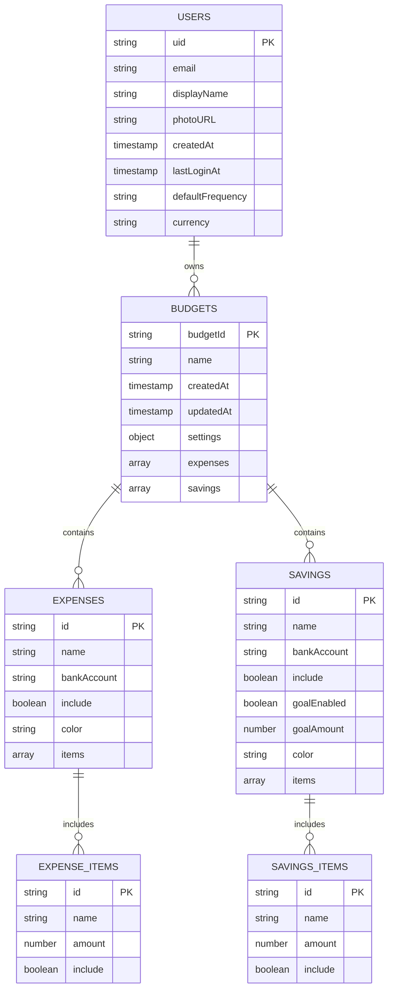

# Data Model

## Firestore Collection Structure



## Collection: `users/{uid}`

User profile and account settings.

```javascript
{
  "uid": "user123abc", // Firebase Auth UID
  "email": "user@example.com",
  "displayName": "John Smith",
  "photoURL": "https://example.com/photo.jpg",
  "createdAt": "2025-08-20T10:00:00Z",
  "lastLoginAt": "2025-08-20T14:30:00Z",
  "defaultFrequency": "Fortnightly", // Weekly|Fortnightly|Monthly|Yearly
  "currency": "AUD",
  "preferences": {
    "theme": "dark",
    "autoSave": true,
    "notifications": false
  }
}
```

**Source**: `app/cloud-store.js:200-220`

## Collection: `users/{uid}/budgets/{budgetId}`

Individual budget documents containing all expense and savings buckets.

```javascript
{
  "budgetId": "budget_20250820_001",
  "name": "August 2025 Budget",
  "createdAt": "2025-08-20T10:00:00Z",
  "updatedAt": "2025-08-20T14:30:00Z",
  "settings": {
    "incomeAmount": 4500.00,
    "incomeFrequency": "Fortnightly",
    "currency": "AUD",
    "budgetPeriod": "Monthly"
  },
  "expenses": [
    {
      "id": "expenses_housing_001",
      "name": "Housing & Utilities",
      "bankAccount": "Main Checking",
      "include": true,
      "color": "#3b82f6",
      "items": [
        {
          "id": "item_rent_001",
          "name": "Rent",
          "amount": 1800.00,
          "include": true
        },
        {
          "id": "item_utilities_001", 
          "name": "Electricity & Gas",
          "amount": 200.00,
          "include": true
        }
      ]
    }
  ],
  "savings": [
    {
      "id": "savings_emergency_001",
      "name": "Emergency Fund",
      "bankAccount": "High Interest Savings",
      "include": true,
      "goalEnabled": true,
      "goalAmount": 10000.00,
      "color": "#10b981",
      "items": [
        {
          "id": "item_emergency_001",
          "name": "Monthly Contribution",
          "amount": 500.00,
          "include": true
        }
      ]
    }
  ]
}
```

**Source**: `app/cloud-store.js:250-300`

## Data Validation Rules

### Budget Data Validation

```javascript
// From app/cloud-store.js:30-80
function validateBudgetData(budget) {
  const errors = [];
  
  // Required fields
  if (!budget.name || budget.name.trim().length === 0) {
    errors.push('Budget name is required');
  }
  
  // Settings validation
  if (!budget.settings) {
    errors.push('Budget settings are required');
  } else {
    if (!validateNumber(budget.settings.incomeAmount, 0)) {
      errors.push('Income amount must be a positive number');
    }
    if (!['Weekly', 'Fortnightly', 'Monthly', 'Yearly'].includes(budget.settings.incomeFrequency)) {
      errors.push('Invalid income frequency');
    }
  }
  
  // Buckets validation
  budget.expenses?.forEach((bucket, index) => {
    if (!bucket.name) errors.push(`Expense bucket ${index + 1} missing name`);
    bucket.items?.forEach((item, itemIndex) => {
      if (!validateNumber(item.amount, 0)) {
        errors.push(`Invalid amount in expense ${bucket.name} item ${itemIndex + 1}`);
      }
    });
  });
  
  return { valid: errors.length === 0, errors };
}
```

## Firestore Security Rules

```javascript
// From firestore.rules
rules_version = '2';
service cloud.firestore {
  match /databases/{database}/documents {
    // Users can only access their own data
    match /users/{uid} {
      allow read, write: if request.auth != null && request.auth.uid == uid;
      
      // Nested budget documents
      match /budgets/{budgetId} {
        allow read, write: if request.auth != null && request.auth.uid == uid;
      }
    }
    
    // Deny all other access
    match /{document=**} {
      allow read, write: if false;
    }
  }
}
```

## Data Constraints

### Document Limits

| Collection | Max Size | Max Items | Source |
|------------|----------|-----------|---------|
| User Profile | 1MB | N/A | Firestore limit |
| Budget Document | 1MB | 50 buckets | `app/cloud-store.js:100` |
| Bucket Items | - | 200 per bucket | `app/cloud-store.js:105` |
| Budget History | - | 100 budgets per user | `app/cloud-store.js:110` |

### Field Constraints

| Field | Type | Constraints | Validation |
|-------|------|-------------|------------|
| `incomeAmount` | number | >= 0, <= 999999 | `validateNumber()` |
| `bucketAmount` | number | >= 0, <= 999999 | `validateNumber()` |
| `budgetName` | string | 1-100 chars | `trim().length > 0` |
| `bucketName` | string | 1-50 chars | Required |
| `currency` | string | ISO 4217 code | AUD default |
| `frequency` | enum | Weekly/Fortnightly/Monthly/Yearly | Strict validation |

## Indexes

```json
// From firestore.indexes.json
{
  "indexes": [
    {
      "collectionGroup": "budgets",
      "queryScope": "COLLECTION",
      "fields": [
        { "fieldPath": "createdAt", "order": "DESCENDING" },
        { "fieldPath": "name", "order": "ASCENDING" }
      ]
    }
  ]
}
```

## Data Migration Schema

### localStorage → Firestore Mapping

```javascript
// From migrations/import-local.js:50-100
const migrationMapping = {
  // Old localStorage keys → New Firestore paths
  'budgetBuckets_currentBudget': 'users/{uid}/budgets/imported_budget',
  'budgetBuckets_settings': 'users/{uid}/budgets/imported_budget/settings',
  'budgetBuckets_expenses': 'users/{uid}/budgets/imported_budget/expenses',
  'budgetBuckets_savings': 'users/{uid}/budgets/imported_budget/savings'
};
```

## Backup and Recovery

### Data Export Format

```javascript
// Budget export structure from app/app.js:800-850
{
  "exportVersion": "1.0",
  "exportDate": "2025-08-20T14:30:00Z",
  "userData": {
    "uid": "user123abc",
    "email": "user@example.com"
  },
  "budgets": [
    // Full budget documents as shown above
  ]
}
```

This data model provides a scalable, secure foundation for personal finance management with clear validation rules and proper user data isolation.