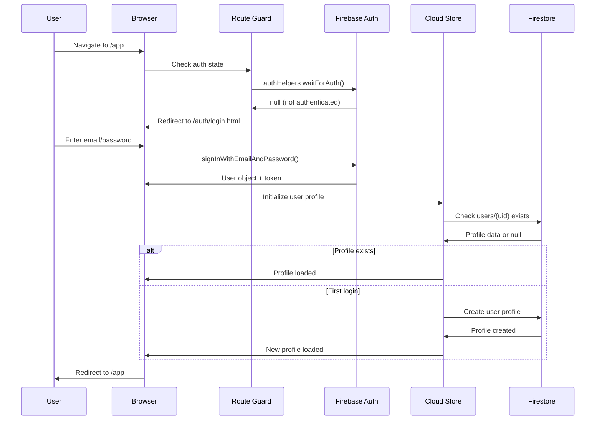
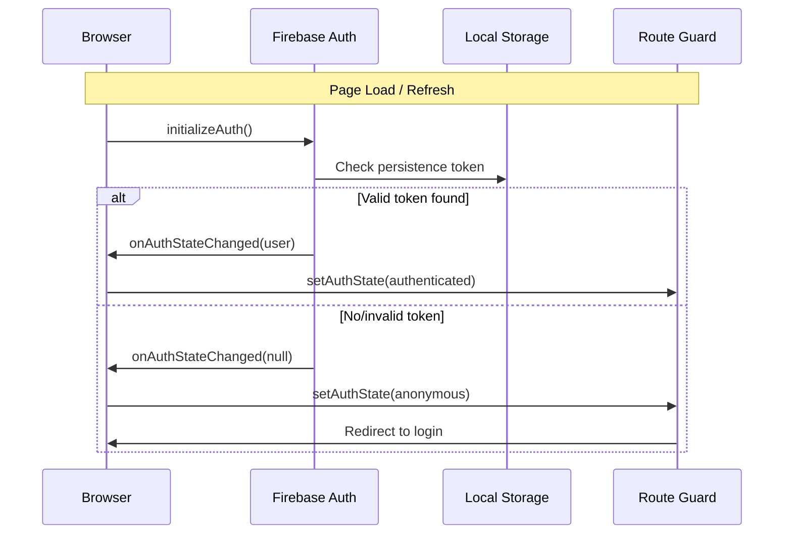
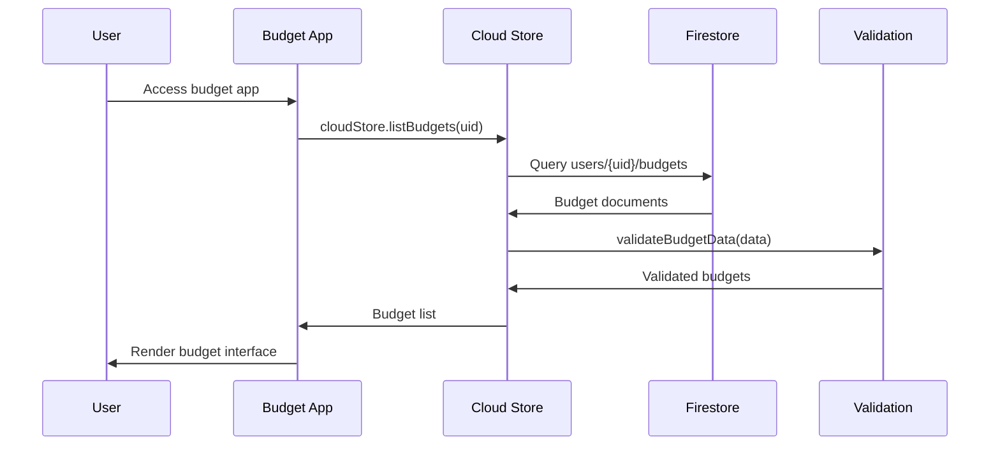
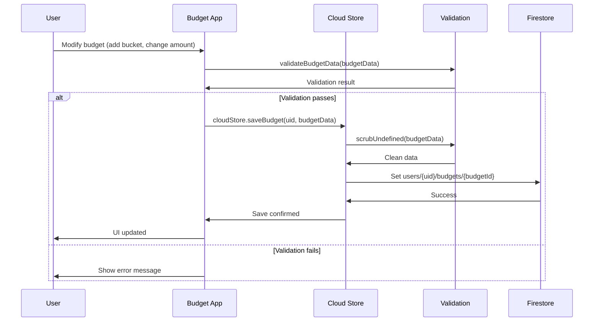
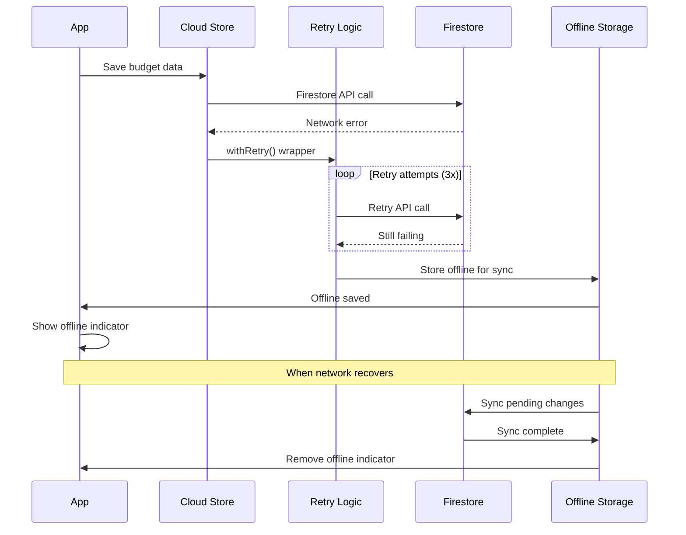
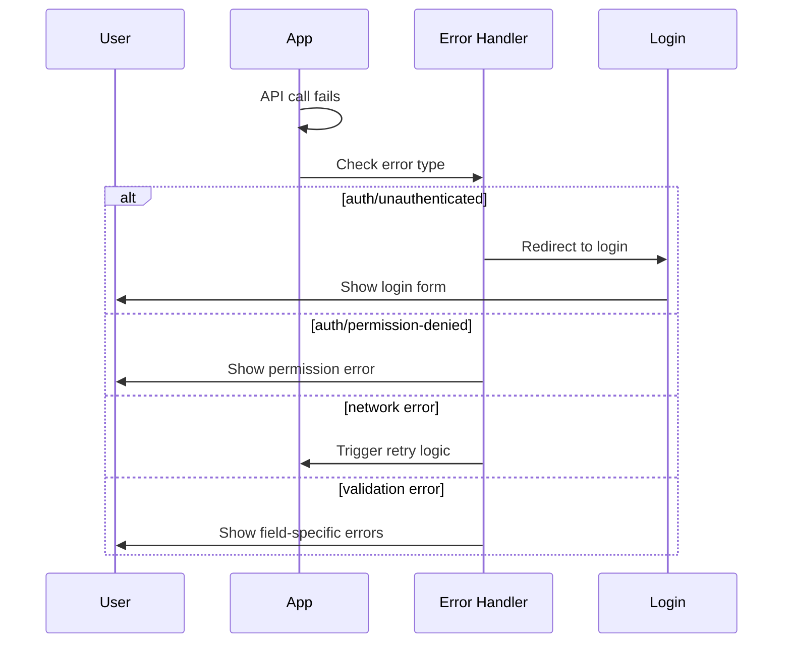
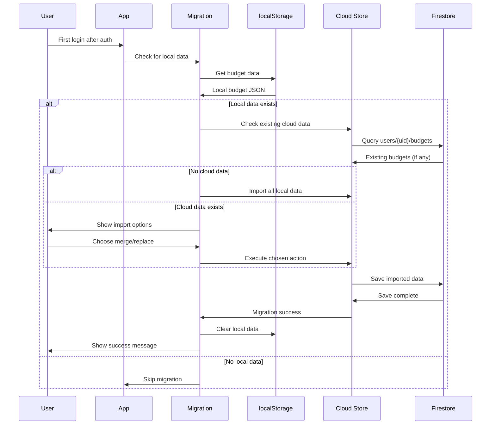
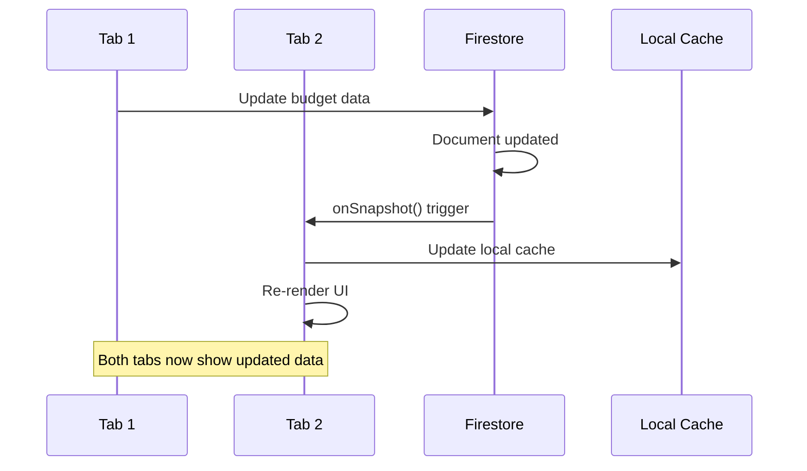
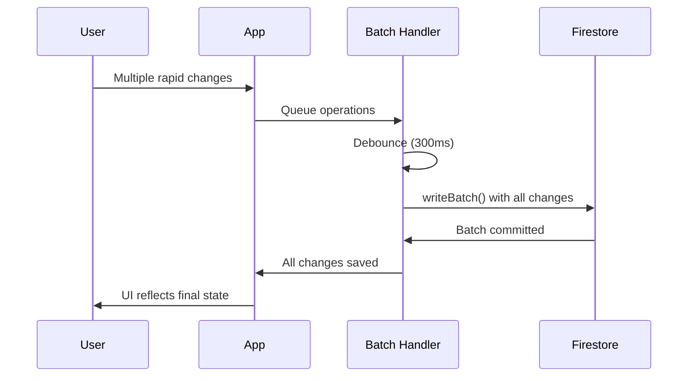

# Data Flow

## Authentication Flow

### Initial Login

### Session Management

## Budget Management Flow

### Loading User Budgets

### Creating/Updating Budgets

## Error Handling Flow

### Network Error Recovery

### Authentication Error Handling

## Data Migration Flow

### localStorage to Firestore Migration

## Real-time Sync Flow

### Multi-tab Synchronization

## Performance Optimizations

### Batch Operations

This data flow architecture ensures reliable, secure, and performant budget management while maintaining real-time synchronization across devices and handling offline scenarios gracefully.