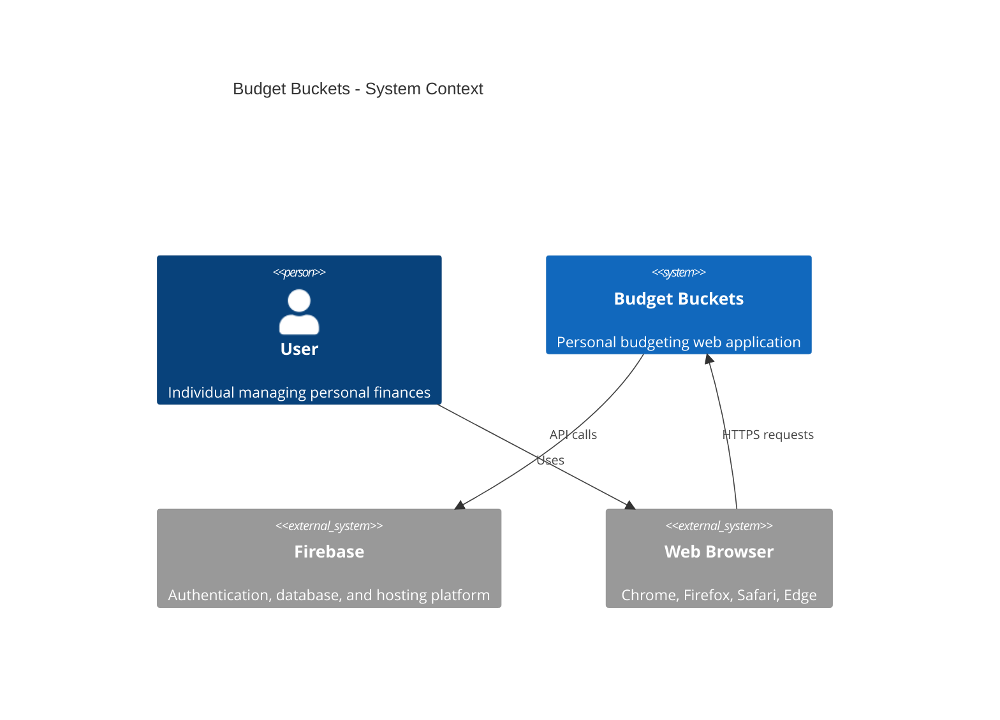
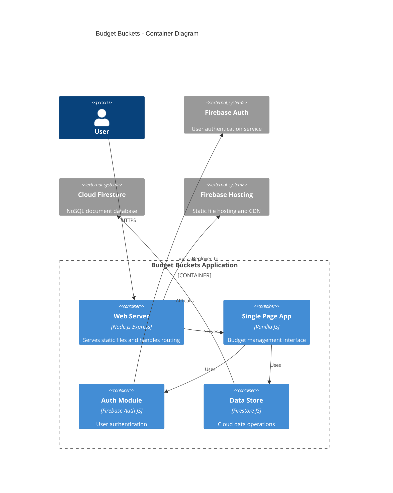
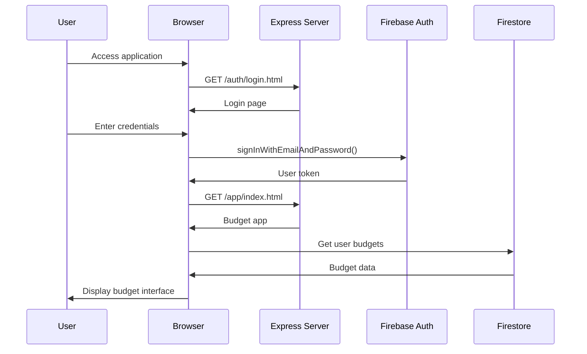

# System Overview

## C4 Context Diagram

## C4 Container Diagram

## Component Overview

### Core Components

| Component | Description | Source Location |
|-----------|-------------|-----------------|
| **Express Server** | Static file server with security headers | `server.js` |
| **Firebase Auth** | User authentication and session management | `auth/firebase.js` |
| **Cloud Store** | Firestore data operations with validation | `app/cloud-store.js` |
| **Budget App** | Main budgeting logic and UI | `app/app.js` |
| **Route Guard** | Authentication protection for routes | `auth/guard.js` |

### Supporting Components

| Component | Description | Source Location |
|-----------|-------------|-----------------|
| **Login UI** | Authentication forms and flows | `auth/login.html`, `auth/auth.js` |
| **Migration** | localStorage to Firestore data migration | `migrations/import-local.js` |
| **Test Suite** | Smoke tests and diagnostics | `test/smoke-test.html` |
| **Environment Switcher** | Development/production toggle | `environment-switcher.html` |

### Configuration

| Component | Description | Source Location |
|-----------|-------------|-----------------|
| **Firebase Config** | Project settings and API keys | `firebase.json` |
| **Security Rules** | Firestore access control | `firestore.rules` |
| **Express Security** | CSP and security headers | `server.js:19-60` |

## Architecture Principles

1. **Framework-free**: Vanilla JavaScript for simplicity and performance
2. **Security-first**: Comprehensive CSP, HTTPS, and user-scoped data access
3. **Offline-capable**: Firebase offline persistence and local storage fallbacks
4. **Progressive**: Works on all modern browsers without build steps
5. **Cloud-native**: Firebase services for authentication, database, and hosting

## Data Flow Overview

## Technology Stack

- **Runtime**: Node.js 20+
- **Framework**: Express.js 4.18+
- **Frontend**: Vanilla HTML/CSS/JavaScript
- **Database**: Cloud Firestore
- **Authentication**: Firebase Auth
- **Hosting**: Firebase App Hosting
- **Security**: Helmet.js, CSP headers