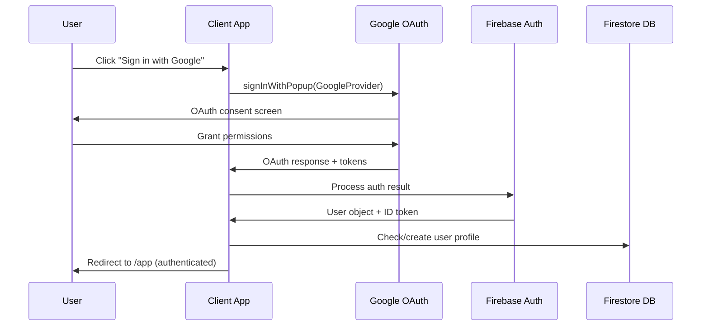
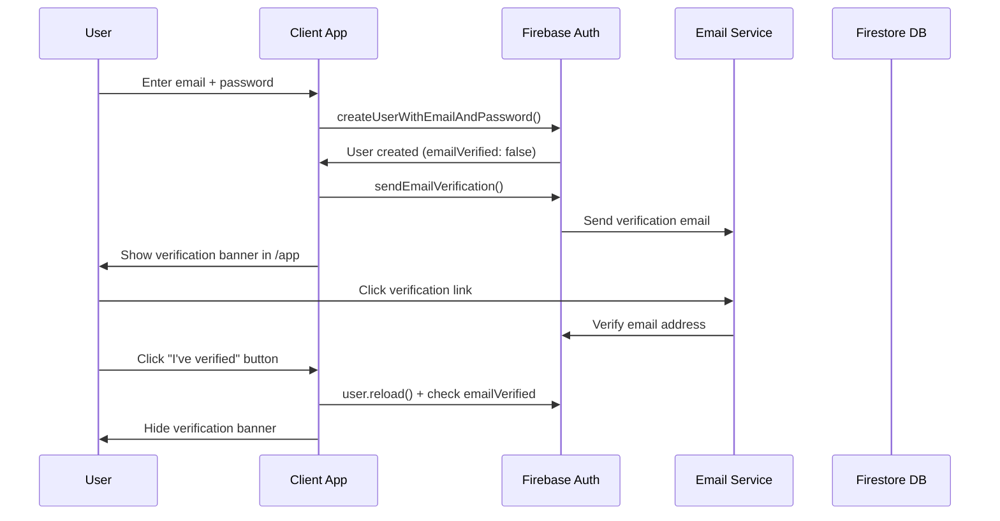
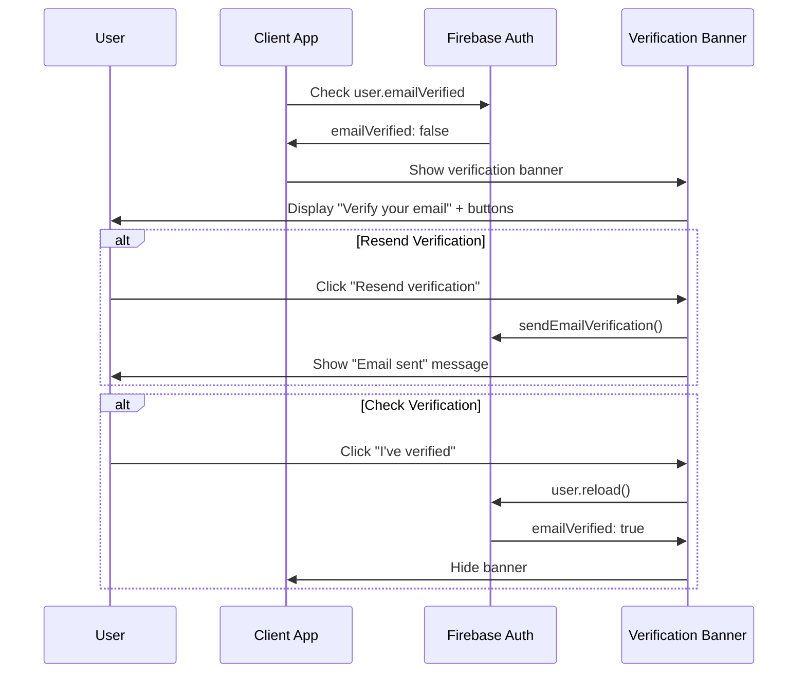
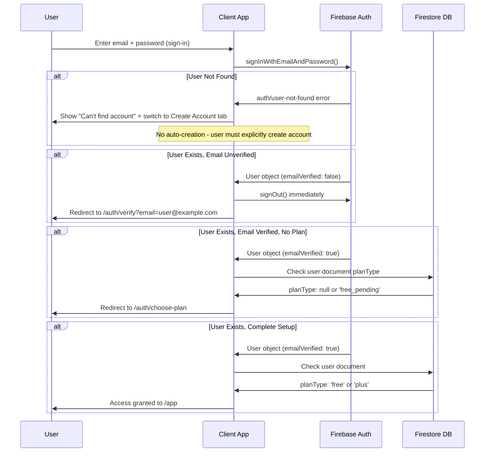
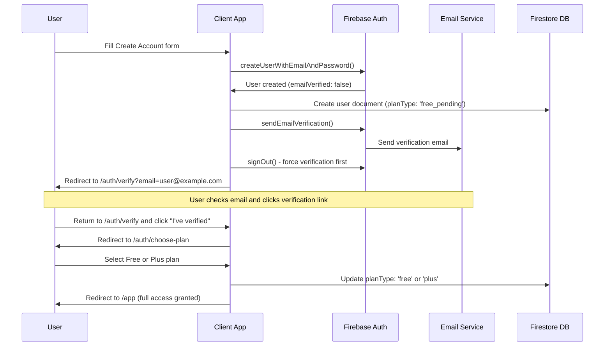
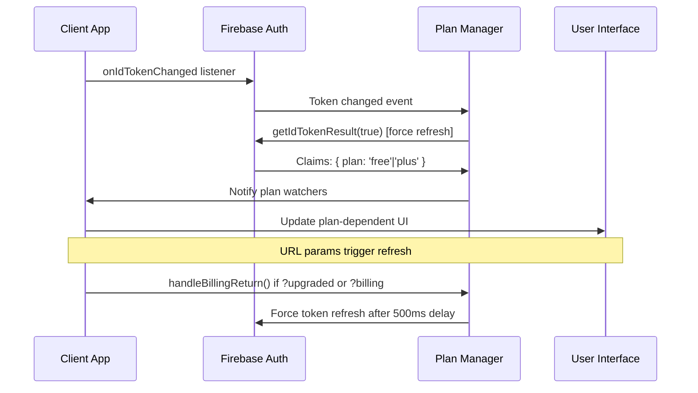
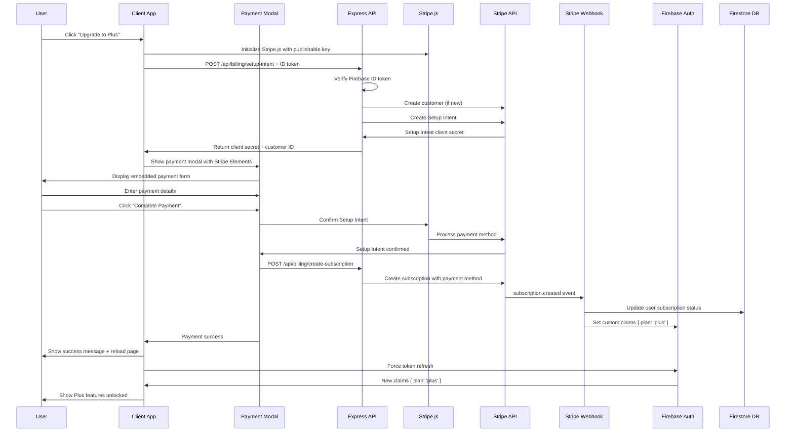
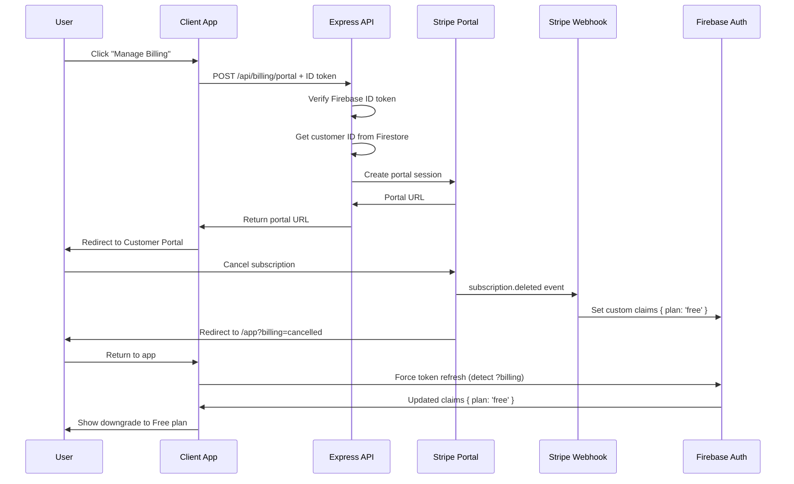
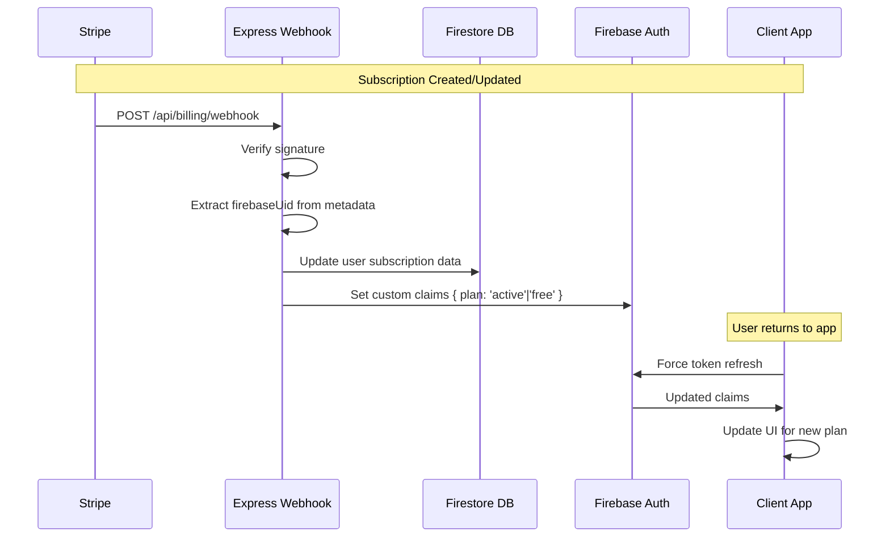

# Authentication & Billing Flows

Complete user journey documentation for Budget Buckets authentication, email verification, plan management, and billing integration.

## 1. Authentication Flows

### 1.1 Google Sign-In Flow



**Implementation:**
```javascript
// auth/auth.js - Google sign-in
async function signInWithGoogle() {
  try {
    const provider = new GoogleAuthProvider();
    const result = await signInWithPopup(auth, provider);
    
    // Auto-redirect to app
    window.location.href = '/app';
    return result;
  } catch (error) {
    handleAuthError(error);
  }
}
```

### 1.2 Email/Password Registration Flow



**Implementation:**
```javascript
// auth/auth.js - Email registration
async function signUpWithEmail(email, password) {
  try {
    const result = await createUserWithEmailAndPassword(auth, email, password);
    
    // Send verification email immediately
    await sendEmailVerification(result.user);
    
    // Redirect to app (will show verification banner)
    window.location.href = '/app';
    return result;
  } catch (error) {
    handleAuthError(error);
  }
}
```

### 1.3 Email Verification Banner Flow



**Implementation:**
```javascript
// app/app-init.js - Email verification banner
if (currentUser && !currentUser.emailVerified) {
  const banner = document.getElementById('emailVerifyBanner');
  banner.style.display = 'block';
  
  // Resend verification email
  document.getElementById('resendVerification').onclick = async () => {
    await sendEmailVerification(currentUser);
    showMessage('Verification email sent! Check your inbox.');
  };
  
  // Check if verified
  document.getElementById('checkVerified').onclick = async () => {
    await currentUser.reload();
    if (currentUser.emailVerified) {
      banner.style.display = 'none';
      showMessage('Email verified! Welcome to Budget Buckets.');
    } else {
      showMessage('Email not verified yet. Please check your inbox.');
    }
  };
}
```

### 1.4 Enhanced Sign-In Flow (No Auto-Account Creation)

**Updated 2025-08-26**: Complete authentication flow with mandatory email verification and plan selection.



### 1.5 Account Creation → Verification → Plan Selection Flow



**Key Implementation Details:**

- **No Auto-Creation**: Sign-in failures with `auth/user-not-found` show error and switch tabs
- **Mandatory Verification**: Password users must verify email before plan selection
- **Race Condition Protection**: Uses `sessionStorage.setItem('planJustSelected')` to prevent redirect loops
- **Complete User Journey**: sign-up → verification → plan selection → app access
- **Form Validation**: Disabled HTML5 validation for better error handling

## 2. Plan Management Flows

### 2.1 Plan State Synchronization



**Implementation:**
```javascript
// app/lib/plan.js - Plan state management
export function watchPlan(onChange) {
  const auth = getAuth();
  
  onIdTokenChanged(auth, async (user) => {
    if (user) {
      const tokenResult = await user.getIdTokenResult(true); // Force refresh
      const newPlan = tokenResult.claims.plan || 'free';
      
      if (newPlan !== currentPlan) {
        currentPlan = newPlan;
        onChange(newPlan); // Notify UI
      }
    }
  });
  
  // Handle billing returns
  handleBillingReturn();
}

function handleBillingReturn() {
  const urlParams = new URLSearchParams(window.location.search);
  
  if (urlParams.has('upgraded') || urlParams.has('billing')) {
    // Force refresh after billing operations
    setTimeout(async () => {
      await refreshPlan();
    }, 500);
    
    // Clean URL
    const url = new URL(window.location);
    url.searchParams.delete('upgraded');
    url.searchParams.delete('billing');
    window.history.replaceState({}, '', url.toString());
  }
}
```

### 2.2 Plan Enforcement in UI

```javascript
// app/lib/plan.js - Plan-dependent UI updates
export function watchPlan(onChange) {
  planWatchers.push(onChange);
}

// Usage in components
watchPlan((plan) => {
  const upgradeButton = document.getElementById('upgradeButton');
  const createButton = document.getElementById('createBucketButton');
  
  if (plan === 'plus') {
    upgradeButton.style.display = 'none';
    createButton.disabled = false;
    createButton.textContent = 'Create New Bucket';
  } else {
    upgradeButton.style.display = 'block';
    // Check bucket count for free limit
    updateCreateButtonForFreeLimit();
  }
});
```

## 3. Billing Flows

### 3.1 Upgrade to Plus Flow (Modern Stripe.js Implementation)



**Implementation:**
```javascript
// assets/js/stripe-payment.js - Modern Stripe.js integration
export async function initializeStripe() {
  // Load Stripe.js library dynamically
  if (!window.Stripe) {
    const script = document.createElement('script');
    script.src = 'https://js.stripe.com/v3/';
    document.head.appendChild(script);
    await new Promise((resolve, reject) => {
      script.onload = resolve;
      script.onerror = reject;
    });
  }
  
  // Get publishable key from server
  const response = await fetch('/api/billing/stripe-key');
  const { publishableKey } = await response.json();
  
  // Initialize Stripe with publishable key
  stripe = window.Stripe(publishableKey);
  return stripe;
}

export async function createPaymentElement(containerId, options) {
  // Create Setup Intent for subscription
  const response = await fetch('/api/billing/setup-intent', {
    method: 'POST',
    headers: {
      'Content-Type': 'application/json',
      'Authorization': `Bearer ${options.idToken}`
    },
    body: JSON.stringify({
      uid: options.uid,
      email: options.email,
      priceId: options.priceId
    })
  });
  
  const { clientSecret, customerId } = await response.json();
  
  // Create Stripe Elements with dark theme
  elements = stripe.elements({
    clientSecret,
    appearance: {
      theme: 'night',
      variables: {
        colorPrimary: '#00cdd6',
        colorBackground: '#0f1720',
        colorText: '#ffffff'
      }
    }
  });
  
  // Create and mount Payment Element
  paymentElement = elements.create('payment', {
    layout: 'tabs'
  });
  paymentElement.mount(`#${containerId}`);
  
  return { elements, paymentElement, clientSecret, customerId };
}

// app/account.js - Updated upgrade flow
async function handleUpgrade() {
  if (!stripe) {
    stripe = await initializeStripe();
  }
  
  // Create payment modal dynamically
  createPaymentModal();
  
  // Create payment element
  paymentElementData = await createPaymentElement('stripe-payment-element', {
    uid: currentUser.uid,
    email: currentUser.email,
    priceId: PRICE_ID_MONTHLY,
    idToken: await getIdToken(currentUser)
  });
  
  // Show modal
  showPaymentModal();
}
```

### 3.2 Manage Billing (Customer Portal) Flow



**Implementation:**
```javascript
// app/account.js - Manage billing flow
async function manageBilling() {
  try {
    const user = auth.currentUser;
    const token = await user.getIdToken();
    
    const response = await fetch('/api/billing/portal', {
      method: 'POST',
      headers: {
        'Authorization': `Bearer ${token}`
      }
    });
    
    if (!response.ok) {
      if (response.status === 400) {
        showError('No billing account found. Please upgrade to Plus first.');
        return;
      }
      throw new Error('Failed to access billing portal');
    }
    
    const { url } = await response.json();
    window.location.href = url; // Redirect to Portal
    
  } catch (error) {
    console.error('Portal error:', error);
    showError('Failed to access billing portal. Please try again.');
  }
}
```

## 4. Webhook Integration Flow

### 4.1 Subscription Lifecycle Events



**Implementation:**
```javascript
// server.js - Webhook handler
app.post('/api/billing/webhook', async (req, res) => {
  const sig = req.headers['stripe-signature'];
  
  try {
    // Verify webhook signature
    const event = stripe.webhooks.constructEvent(req.body, sig, webhookSecret);
    
    switch (event.type) {
      case 'customer.subscription.created':
      case 'customer.subscription.updated':
        const subscription = event.data.object;
        const status = subscription.status;
        const firebaseUid = subscription.metadata?.firebase_uid;
        
        if (firebaseUid) {
          // Update Firestore
          await db.collection('users').doc(firebaseUid).set({
            subscriptionId: subscription.id,
            subscriptionStatus: status,
            planType: status === 'active' ? 'plus' : 'free',
            updatedAt: admin.firestore.FieldValue.serverTimestamp()
          }, { merge: true });
          
          // Update custom claims
          await admin.auth().setCustomUserClaims(firebaseUid, {
            plan: status === 'active' ? 'plus' : 'free'
          });
        }
        break;
        
      case 'customer.subscription.deleted':
        const deletedSub = event.data.object;
        const uid = deletedSub.metadata?.firebase_uid;
        
        if (uid) {
          // Revert to free plan
          await admin.auth().setCustomUserClaims(uid, { plan: 'free' });
          await db.collection('users').doc(uid).set({
            subscriptionStatus: 'canceled',
            planType: 'free'
          }, { merge: true });
        }
        break;
    }
    
    res.json({ received: true });
  } catch (error) {
    console.error('Webhook error:', error);
    res.status(400).send('Webhook Error');
  }
});
```

## 5. Token Refresh Strategies

### 5.1 Automatic Refresh Points

```javascript
// app/lib/plan.js - Strategic refresh points
export function watchPlan(onChange) {
  const auth = getAuth();
  
  // 1. Token change listener (primary)
  onIdTokenChanged(auth, async (user) => {
    if (user) await refreshPlan(user);
  });
  
  // 2. Billing return detection
  if (urlParams.has('upgraded') || urlParams.has('billing')) {
    setTimeout(() => refreshPlan(), 500); // Allow webhook processing time
  }
  
  // 3. Tab focus (for Customer Portal returns)
  document.addEventListener('visibilitychange', async () => {
    if (!document.hidden && auth.currentUser) {
      await refreshPlan(auth.currentUser);
    }
  });
}
```

### 5.2 Manual Refresh Triggers

```javascript
// app/account.js - Manual refresh after actions
async function handleUpgradeReturn() {
  const urlParams = new URLSearchParams(window.location.search);
  
  if (urlParams.get('upgrade') === 'success') {
    // Show success message
    showSuccess('Welcome to Budget Buckets Plus! You now have unlimited buckets.');
    
    // Force plan refresh to unlock features
    await refreshPlan();
    
    // Clean URL
    window.history.replaceState({}, '', '/app');
  }
}
```

## 6. Error Handling & Recovery

### 6.1 Authentication Errors

```javascript
// auth/auth.js - Comprehensive error handling
function handleAuthError(error) {
  switch (error.code) {
    case 'auth/popup-closed-by-user':
      showMessage('Sign-in cancelled. Please try again.');
      break;
    case 'auth/popup-blocked':
      showError('Popup blocked. Please allow popups and try again.');
      break;
    case 'auth/email-already-in-use':
      showError('Email already registered. Try signing in instead.');
      break;
    case 'auth/weak-password':
      showError('Password too weak. Please use at least 6 characters.');
      break;
    case 'auth/user-not-found':
      showError('Account not found. Please sign up first.');
      break;
    case 'auth/wrong-password':
      showError('Incorrect password. Try again or reset your password.');
      break;
    case 'auth/network-request-failed':
      showError('Network error. Please check your connection.');
      break;
    default:
      console.error('Auth error:', error);
      showError('Sign-in failed. Please try again.');
  }
}
```

### 6.2 Billing Errors

```javascript
// app/account.js - Billing error handling
async function handleBillingAction(action) {
  try {
    await action();
  } catch (error) {
    switch (error.status) {
      case 401:
        showError('Please sign in again to access billing.');
        window.location.href = '/auth/login';
        break;
      case 400:
        showError('No billing account found. Please upgrade first.');
        break;
      case 503:
        showError('Billing service temporarily unavailable. Please try again later.');
        break;
      default:
        showError('Billing operation failed. Please try again.');
    }
  }
}
```

## 7. Testing Scenarios

### 7.1 Authentication Testing

```bash
# Test flows manually or with automation
1. Google Sign-in → verify redirect to /app
2. Email registration → verify verification banner
3. Email verification → verify banner disappears  
4. Sign out → verify redirect to login
5. Popup blocked → verify fallback message
```

### 7.2 Billing Flow Testing

```bash
# Test with Stripe test environment
1. Free user upgrade → verify Plus features unlocked
2. Plus user Portal access → verify can cancel
3. Subscription cancellation → verify Free plan restored
4. Failed payment → verify plan remains active initially
5. Webhook delivery failure → verify plan state recovery
```

---

**Last updated: 23 Aug 2025 (AEST)** - Updated with modern Stripe.js implementation