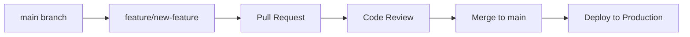

# Contributing to Budget Buckets

Welcome to Budget Buckets! This guide outlines the development workflow, coding standards, and contribution process.

## Development Setup

### Prerequisites
- Node.js 20+ ([Installation Guide](./docs/guides/setup-dev.md#prerequisites))
- Firebase CLI (`npm install -g firebase-tools`)
- Git configured with your details

### Quick Start
```bash
# 1. Clone repository
git clone https://github.com/Deedubsy/BudgetBuckets.git
cd BudgetBuckets

# 2. Install dependencies
npm install

# 3. Configure Firebase (see setup guide)
cp auth/firebase-config.sample.js auth/firebase-config.js
# Edit firebase-config.js with your project settings

# 4. Start development environment
firebase emulators:start --import=./emulator-data &
npm run dev

# 5. Verify setup
# Visit: http://localhost:8080/test/smoke-test.html?autorun=true
```

For detailed setup instructions, see the [Development Setup Guide](./docs/guides/setup-dev.md).

## Development Workflow

### Git Workflow

Budget Buckets uses **GitHub Flow** with feature branches:



#### Branch Naming Convention
- **Features**: `feature/description-of-feature`
- **Bug fixes**: `fix/issue-description`
- **Documentation**: `docs/what-changed`
- **Hotfixes**: `hotfix/critical-issue`

Examples:
- `feature/add-budget-categories`
- `fix/authentication-redirect-loop`
- `docs/update-api-reference`

### Development Process

#### 1. Create Feature Branch
```bash
# Start from latest main
git checkout main
git pull origin main

# Create feature branch
git checkout -b feature/add-expense-tagging

# Work on your changes...
```

#### 2. Development Standards

**Before starting work:**
- [ ] Review existing code patterns in relevant files
- [ ] Check if similar functionality exists elsewhere
- [ ] Read related documentation in `docs/`
- [ ] Understand the data model in `docs/architecture/data-model.md`

**While developing:**
- [ ] Follow existing code style and patterns
- [ ] Write clean, self-documenting code
- [ ] Add input validation for user-facing features
- [ ] Test with Firebase emulators
- [ ] Verify changes don't break existing functionality

#### 3. Testing Requirements

**Manual Testing (Required)**:
```bash
# Run smoke test suite
# Visit: http://localhost:8080/test/smoke-test.html?autorun=true
# All tests must pass

# Test key user flows:
# 1. Authentication (sign in/sign up)
# 2. Create/edit/delete budget
# 3. Data persistence across browser refresh
# 4. Calculations are correct
```

**Automated Testing (Recommended)**:
```bash
# If unit tests exist
npm test

# If E2E tests exist
npm run test:e2e
```

#### 4. Pre-commit Checklist

- [ ] Code follows project conventions
- [ ] No console.log statements in production code
- [ ] All user inputs are validated
- [ ] Error handling is implemented
- [ ] Manual testing completed successfully
- [ ] No Firebase emulator warnings/errors
- [ ] Browser console is clean (no errors/warnings)

#### 5. Commit Guidelines

**Commit Message Format**:
```
<type>(<scope>): <description>

[optional body]

[optional footer]
```

**Types**:
- `feat`: New feature
- `fix`: Bug fix  
- `docs`: Documentation changes
- `style`: Code style changes (formatting, etc.)
- `refactor`: Code refactoring
- `test`: Adding or updating tests
- `chore`: Maintenance tasks

**Examples**:
```bash
feat(budget): add expense category color picker

- Add color selection for expense categories
- Update UI to show category colors in budget view
- Persist color choices to Firestore

Fixes #123
```

```bash
fix(auth): resolve redirect loop on logout

The sign-out process was causing infinite redirects when
users had expired sessions.

- Clear localStorage on signOut
- Add proper error handling for auth state changes
- Update auth guard logic

Closes #456
```

## Code Standards

### JavaScript Style Guide

Budget Buckets uses **vanilla JavaScript** with modern ES6+ features:

#### General Principles
- **Clarity over cleverness**: Write code that's easy to understand
- **Consistency**: Follow existing patterns in the codebase
- **Error handling**: Always handle potential failures gracefully
- **Performance**: Consider the impact on user experience

#### Code Style
```javascript
// ✅ Good: Clear variable names
const totalMonthlyExpenses = calculateExpenseTotal(budget.expenses);
const authenticatedUser = await authHelpers.waitForAuth();

// ❌ Avoid: Unclear abbreviations  
const totExpMon = calcExpTot(bud.exp);
const autUsr = await auth.wait();

// ✅ Good: Consistent function structure
async function saveBudgetData(userId, budgetData) {
  try {
    // Validate input
    const validationErrors = validateBudgetData(budgetData);
    if (validationErrors.length > 0) {
      throw new Error(`Validation failed: ${validationErrors.join(', ')}`);
    }
    
    // Clean data
    const cleanData = scrubUndefined(budgetData);
    
    // Save to database
    const docRef = doc(db, `users/${userId}/budgets`, budgetData.id);
    await setDoc(docRef, cleanData);
    
    return { success: true, id: budgetData.id };
  } catch (error) {
    console.error('Failed to save budget:', error);
    throw new Error('Failed to save budget. Please try again.');
  }
}

// ❌ Avoid: No error handling
async function saveBudgetData(userId, budgetData) {
  const docRef = doc(db, `users/${userId}/budgets`, budgetData.id);
  await setDoc(docRef, budgetData);
  return budgetData.id;
}
```

#### Module Organization
```javascript
// ✅ Good: Clear module structure with exports
// File: auth/firebase.js
export const authHelpers = {
  async waitForAuth(timeout = 10000) { /* implementation */ },
  async signInWithGoogle() { /* implementation */ },
  async signOut() { /* implementation */ }
};

export const firestoreHelpers = {
  async saveDocument(collection, data) { /* implementation */ },
  async loadDocument(collection, id) { /* implementation */ }
};

// File: app/budget-calculations.js
export function calculateTotalExpenses(budget) { /* implementation */ }
export function calculateBudgetBalance(budget) { /* implementation */ }
export function formatCurrency(amount, currency = 'AUD') { /* implementation */ }
```

#### Error Handling Patterns
```javascript
// ✅ Good: Comprehensive error handling
async function loadUserBudgets(userId) {
  try {
    const budgetsRef = collection(db, `users/${userId}/budgets`);
    const querySnapshot = await getDocs(budgetsRef);
    
    if (querySnapshot.empty) {
      return []; // Return empty array, not error
    }
    
    const budgets = [];
    querySnapshot.forEach(doc => {
      try {
        const budgetData = doc.data();
        // Validate each document
        if (budgetData.name && budgetData.settings) {
          budgets.push({ id: doc.id, ...budgetData });
        } else {
          console.warn(`Invalid budget data for document ${doc.id}`);
        }
      } catch (docError) {
        console.error(`Failed to process budget document ${doc.id}:`, docError);
        // Continue processing other documents
      }
    });
    
    return budgets;
  } catch (error) {
    console.error('Failed to load user budgets:', error);
    
    // Provide helpful error messages
    if (error.code === 'permission-denied') {
      throw new Error('You don\'t have permission to access this data. Please sign in again.');
    } else if (error.code === 'unavailable') {
      throw new Error('Budget data is temporarily unavailable. Please try again.');
    } else {
      throw new Error('Failed to load budgets. Please check your connection and try again.');
    }
  }
}
```

### HTML/CSS Standards

#### HTML Structure
```html
<!-- ✅ Good: Semantic HTML with proper accessibility -->
<section class="budget-section">
  <h2 class="section-title">Monthly Expenses</h2>
  <form class="expense-form" role="form" aria-label="Add expense">
    <label for="expense-name" class="form-label">Expense Name</label>
    <input 
      type="text" 
      id="expense-name" 
      class="form-input"
      data-testid="expense-name-input"
      required 
      aria-describedby="expense-name-help"
    />
    <div id="expense-name-help" class="form-help">
      Enter a descriptive name for this expense
    </div>
    
    <button type="submit" class="btn btn-primary" data-testid="save-expense">
      Save Expense
    </button>
  </form>
</section>

<!-- ❌ Avoid: Non-semantic, inaccessible HTML -->
<div class="budget">
  <div class="title">Monthly Expenses</div>
  <div>
    <div>Name</div>
    <input type="text" />
    <div onclick="save()">Save</div>
  </div>
</div>
```

#### CSS Organization
```css
/* ✅ Good: Organized, maintainable CSS */

/* Component: Budget Card */
.budget-card {
  background: white;
  border-radius: 8px;
  box-shadow: 0 2px 4px rgba(0, 0, 0, 0.1);
  padding: 1.5rem;
  margin-bottom: 1rem;
  transition: transform 0.2s ease;
}

.budget-card:hover {
  transform: translateY(-2px);
}

.budget-card__title {
  font-size: 1.25rem;
  font-weight: 600;
  color: #1f2937;
  margin-bottom: 0.5rem;
}

.budget-card__amount {
  font-size: 2rem;
  font-weight: 700;
  color: #10b981;
}

.budget-card__amount--negative {
  color: #ef4444;
}

/* Responsive breakpoints */
@media (max-width: 768px) {
  .budget-card {
    padding: 1rem;
    margin-bottom: 0.75rem;
  }
  
  .budget-card__amount {
    font-size: 1.5rem;
  }
}
```

### Firebase Integration Standards

#### Firestore Best Practices
```javascript
// ✅ Good: Proper Firestore usage
async function saveBudgetWithBatch(userId, budgets) {
  const batch = writeBatch(db);
  const timestamp = serverTimestamp();
  
  budgets.forEach(budget => {
    const budgetRef = doc(db, `users/${userId}/budgets`, budget.id);
    batch.set(budgetRef, {
      ...budget,
      lastModified: timestamp,
      version: 2 // Schema version
    });
  });
  
  try {
    await batch.commit();
    console.log('Batch save completed successfully');
  } catch (error) {
    console.error('Batch save failed:', error);
    throw error;
  }
}

// ✅ Good: Real-time listeners with cleanup
function setupBudgetListener(userId, callback) {
  const budgetsRef = collection(db, `users/${userId}/budgets`);
  const q = query(budgetsRef, orderBy('lastModified', 'desc'));
  
  const unsubscribe = onSnapshot(q, (snapshot) => {
    const budgets = [];
    snapshot.forEach(doc => {
      budgets.push({ id: doc.id, ...doc.data() });
    });
    callback(budgets);
  }, (error) => {
    console.error('Budget listener error:', error);
    callback(null, error);
  });
  
  // Return cleanup function
  return unsubscribe;
}

// Usage with cleanup
let budgetUnsubscribe;

function startListening() {
  budgetUnsubscribe = setupBudgetListener(userId, handleBudgetUpdate);
}

function stopListening() {
  if (budgetUnsubscribe) {
    budgetUnsubscribe();
    budgetUnsubscribe = null;
  }
}

// Clean up when page unloads
window.addEventListener('beforeunload', stopListening);
```

## Pull Request Process

### Creating a Pull Request

#### 1. Prepare for Review
```bash
# Ensure branch is up to date
git checkout main
git pull origin main
git checkout feature/your-feature
git rebase main

# Run final tests
# Visit: http://localhost:8080/test/smoke-test.html?autorun=true

# Push branch
git push origin feature/your-feature
```

#### 2. Pull Request Template
Create PR with this information:

```markdown
## Summary
Brief description of what this PR accomplishes.

## Changes
- Detailed list of changes made
- New features added
- Bug fixes implemented
- Refactoring performed

## Testing
- [ ] Smoke test suite passes
- [ ] Manual testing completed for affected features
- [ ] Cross-browser testing (if UI changes)
- [ ] Edge cases considered and tested

## Screenshots
If UI changes, include before/after screenshots.

## Documentation
- [ ] README updated (if needed)
- [ ] Documentation updated in `docs/` (if needed)
- [ ] Comments added for complex logic

## Checklist
- [ ] Code follows project conventions
- [ ] No console.log statements in production code
- [ ] Error handling implemented
- [ ] Input validation added (if applicable)
- [ ] Backwards compatibility maintained

## Related Issues
Closes #123
References #456
```

### Code Review Process

#### For Authors
- **Respond promptly** to review feedback
- **Explain your reasoning** for implementation choices
- **Address all feedback** or explain why you disagree
- **Keep PRs focused** on a single feature or fix
- **Update documentation** when changing functionality

#### For Reviewers
- **Be constructive** in feedback
- **Explain the "why"** behind suggestions
- **Test the changes** locally when possible
- **Review the entire change** including documentation
- **Approve only when satisfied** with code quality

#### Review Checklist

**Functionality**:
- [ ] Code works as intended
- [ ] Edge cases are handled
- [ ] Error conditions are handled gracefully
- [ ] User experience is intuitive

**Code Quality**:
- [ ] Code is readable and well-organized
- [ ] Functions have clear responsibilities
- [ ] Variable names are descriptive
- [ ] Comments explain complex logic

**Security**:
- [ ] User inputs are validated
- [ ] No sensitive data in client-side code
- [ ] Proper authentication checks
- [ ] Firestore security rules respected

**Performance**:
- [ ] No unnecessary database operations
- [ ] Efficient DOM manipulations
- [ ] Appropriate error handling without blocking

## Common Issues and Solutions

### Authentication Issues
```javascript
// Common issue: Not waiting for auth state
// ❌ Problem
const user = firebase.auth().currentUser; // Might be null
if (user) {
  loadUserData(user.uid);
}

// ✅ Solution
const user = await authHelpers.waitForAuth();
if (user) {
  loadUserData(user.uid);
} else {
  redirectToLogin();
}
```

### Data Validation Issues
```javascript
// Common issue: Not validating user input
// ❌ Problem  
const amount = parseFloat(userInput.value);
await saveBudgetItem({ amount });

// ✅ Solution
const amount = parseFloat(userInput.value);
if (isNaN(amount) || amount < 0 || amount > 999999.99) {
  showError('Please enter a valid amount between $0 and $999,999.99');
  return;
}
await saveBudgetItem({ amount });
```

### Firebase Permission Issues
```javascript
// Common issue: Not handling permission errors
// ❌ Problem
try {
  await setDoc(docRef, data);
} catch (error) {
  console.log('Save failed');
}

// ✅ Solution  
try {
  await setDoc(docRef, data);
} catch (error) {
  if (error.code === 'permission-denied') {
    showError('You don\'t have permission to save this data. Please sign in again.');
    redirectToLogin();
  } else if (error.code === 'unavailable') {
    showError('Service temporarily unavailable. Please try again.');
  } else {
    console.error('Unexpected error:', error);
    showError('Failed to save data. Please try again.');
  }
}
```

## Release Process

### Version Management
Budget Buckets uses semantic versioning:
- **Major** (1.0.0): Breaking changes
- **Minor** (0.1.0): New features, backwards compatible  
- **Patch** (0.0.1): Bug fixes

### Deployment Process
1. **Code Review**: All changes reviewed and approved
2. **Testing**: Full manual testing completed
3. **Documentation**: Updated as needed
4. **Deployment**: Automated via GitHub Actions
5. **Monitoring**: 24-hour monitoring period post-deployment

## Getting Help

### Documentation Resources
- [System Architecture](./docs/architecture/system-overview.md)
- [Development Setup](./docs/guides/setup-dev.md)  
- [Troubleshooting Guide](./docs/guides/troubleshooting.md)
- [API Reference](./docs/reference/http-api.md)

### Communication Channels
- **Issues**: GitHub Issues for bug reports and feature requests
- **Discussions**: GitHub Discussions for questions and ideas
- **Email**: [repository owner] for private concerns

### Common Questions

**Q: How do I test my changes?**
A: Use the built-in test suite at `http://localhost:8080/test/smoke-test.html?autorun=true`. All tests should pass before submitting a PR.

**Q: How do I handle Firebase errors?**
A: Always wrap Firebase operations in try-catch blocks and provide user-friendly error messages. See the error handling examples above.

**Q: Can I add new dependencies?**
A: Generally avoid adding new dependencies. Budget Buckets uses minimal dependencies intentionally. If you need a new dependency, discuss it in an issue first.

**Q: How do I update documentation?**
A: Documentation lives in the `docs/` directory. Update relevant files when changing functionality, and add new documentation for new features.

## Code of Conduct

### Our Standards
- **Be respectful** in all interactions
- **Be constructive** in feedback and discussions
- **Be collaborative** and help others learn
- **Be patient** with questions and different skill levels

### Reporting Issues
If you experience unacceptable behavior, please report it by contacting the repository maintainers.

---

Thank you for contributing to Budget Buckets! Your efforts help make personal finance management more accessible and effective for everyone.