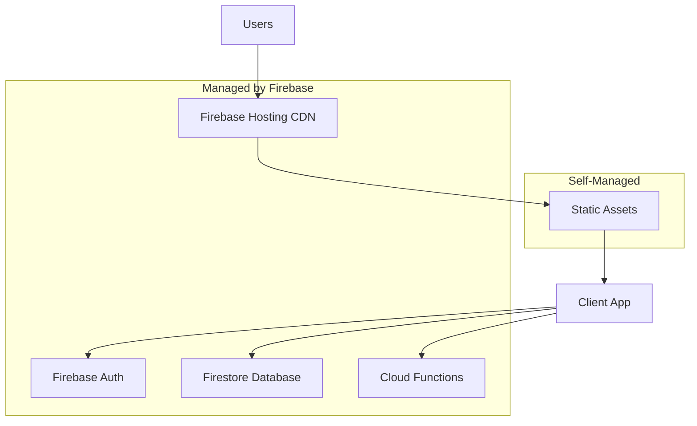

# Service Restart Procedures

Emergency procedures for restarting Budget Buckets services during outages or performance issues.

## Service Architecture Overview

Budget Buckets uses Firebase managed services with minimal server-side components:



## Service Dependencies

| Service | Type | Restart Required | Impact |
|---------|------|------------------|---------|
| Firebase Hosting | Managed | No | Static content delivery |
| Firebase Auth | Managed | No | User authentication |
| Firestore Database | Managed | No | Data persistence |
| Cloud Functions | Managed | Rare | API endpoints (if any) |
| Client Applications | Static | Redeploy | User interface |

## Emergency Contact Information

### Firebase Support
- **Console**: https://console.firebase.google.com/support
- **Status Page**: https://status.firebase.google.com/
- **Priority Support**: Available with Blaze plan

### Internal Team
- **Primary Engineer**: ${PLACEHOLDER_PRIMARY_ENGINEER}
- **Secondary Engineer**: ${PLACEHOLDER_SECONDARY_ENGINEER} 
- **Emergency Phone**: ${PLACEHOLDER_EMERGENCY_PHONE}

## Incident Response Procedures

### 1. Initial Assessment (5 minutes)

#### Check Service Status
```bash
# 1. Firebase services status
curl -I https://firebase.googleapis.com/
# Should return 200 OK

# 2. Application availability
curl -I https://budgetbucket.app/
# Should return 200 OK with security headers

# 3. Authentication endpoint
curl -I https://identitytoolkit.googleapis.com/
# Should return 200 OK or 404 (both indicate service is up)

# 4. Firestore endpoint  
curl -I https://firestore.googleapis.com/
# Should return 200 OK or 401 (both indicate service is up)
```

#### User Impact Assessment
```bash
# Check application functionality
# Visit https://budgetbucket.app/test/smoke-test.html?autorun=true
# All tests should pass within 30 seconds

# Key user flows to verify:
# 1. Homepage loads
# 2. Login page accessible 
# 3. Authentication works
# 4. Data saves/loads correctly
```

### 2. Issue Classification

#### **Level 1: Complete Outage**
- Homepage returns 5xx errors
- Users cannot access application
- Firebase Console shows service down

**Response Time**: Immediate  
**Escalation**: Firebase Support + Internal Team

#### **Level 2: Authentication Issues**
- Users cannot sign in or sign up
- "Firebase not initialized" errors
- OAuth provider failures

**Response Time**: 15 minutes  
**Escalation**: Internal Team

#### **Level 3: Data Issues**
- Users can login but cannot save/load data
- Intermittent Firestore errors
- Slow query performance

**Response Time**: 30 minutes  
**Escalation**: Monitor → Internal Team if persists

#### **Level 4: Performance Degradation**
- Slow page loads
- Increased error rates but service functional
- User complaints about responsiveness

**Response Time**: 1 hour  
**Escalation**: Monitor → Internal Team if severe

## Restart Procedures

### Firebase Hosting (Static Content)

#### Redeploy Application
```bash
# 1. Verify current deployment
firebase hosting:releases:list

# 2. Quick redeploy (no changes)
firebase deploy --only hosting

# 3. Rollback to previous version if needed
firebase hosting:clone SOURCE_SITE_ID:SOURCE_VERSION_ID TARGET_SITE_ID
```

#### Clear CDN Cache
```bash
# Firebase Hosting has no manual cache clear
# Cache TTL is automatic, wait up to 1 hour for global propagation
# Or deploy with cache-busting query parameters
```

### Firebase Authentication

#### Reset Authentication State
```bash
# Cannot restart managed service, but can clear problematic state:

# 1. Check Firebase Auth status
firebase auth:export temp-users.json --project budget-buckets-prod

# 2. If service appears healthy, issue is likely client-side:
# Clear browser storage for affected users
localStorage.clear();
sessionStorage.clear();

# 3. Reset OAuth configuration if needed
# Firebase Console → Authentication → Settings → Sign-in method
# Verify authorized domains and OAuth providers
```

#### OAuth Provider Issues
```bash
# Google OAuth problems:
# 1. Check Google Cloud Console → APIs & Services → Credentials
# 2. Verify OAuth client configuration
# 3. Check authorized domains match production domain

# If OAuth completely broken:
# 1. Temporarily enable email/password only
# 2. Investigate OAuth configuration
# 3. Re-enable OAuth after fix
```

### Firestore Database

#### Connection Issues
```bash
# Firestore is fully managed - cannot restart
# Check connection and permissions:

# 1. Test direct Firestore access
firebase firestore:indexes:list

# 2. Verify security rules  
firebase firestore:rules:get
firebase firestore:rules:test --test-suite=test-data/firestore-rules-test.js

# 3. Check project permissions
firebase projects:list
```

#### Performance Issues
```bash
# Monitor Firestore performance in Firebase Console
# Common solutions:

# 1. Check for missing indexes
# Firebase Console → Firestore → Indexes
# Look for "Index creation suggested" messages

# 2. Review query patterns
# Avoid large result sets without limits
# Use pagination for large data sets

# 3. Check security rules performance
# Complex rules can slow queries
# Firebase Console → Firestore → Rules → Simulator
```

### Client Application Issues

#### Complete Client Failure
```bash
# 1. Check for JavaScript errors
# Browser Console → Network tab → Look for 404s or 5xx errors

# 2. Verify Firebase configuration
# Check auth/firebase-config.js contains correct values

# 3. Test with minimal configuration
# Create test page with basic Firebase init only

# 4. Emergency static page
# Replace index.html with maintenance page if needed
```

#### Authentication Client Issues
```bash
# 1. Firebase SDK initialization errors
# Check browser console for:
# "Firebase: No Firebase App '[DEFAULT]' has been created"
# "Failed to resolve module specifier"

# Solutions:
# - Verify firebase-config.js exists and is valid
# - Check script type="module" in HTML
# - Verify Firebase SDK URLs are accessible

# 2. Clear browser state for affected users
# localStorage.clear(); sessionStorage.clear();

# 3. Test authentication flow manually
# Visit /auth/login.html directly
# Try both email/password and Google OAuth
```

## Recovery Verification

### 1. Automated Health Checks
```bash
# Run comprehensive smoke test
curl "https://budgetbucket.app/test/smoke-test.html?autorun=true"

# Key metrics to verify:
# - Page load time < 3 seconds
# - Firebase initialization successful
# - Authentication flow working
# - Database read/write operations successful
# - No JavaScript errors in console
```

### 2. Manual Verification Checklist

#### Critical User Flows
- [ ] Homepage loads within 3 seconds
- [ ] Login page accessible and functional
- [ ] Google OAuth sign-in works
- [ ] Email/password sign-in works
- [ ] User can create new budget
- [ ] Budget data saves and reloads correctly
- [ ] Expense calculations are accurate
- [ ] Logout works properly

#### Performance Verification
- [ ] First Contentful Paint < 2 seconds
- [ ] Largest Contentful Paint < 4 seconds
- [ ] Cumulative Layout Shift < 0.1
- [ ] No console errors or warnings
- [ ] Database operations complete within 5 seconds

### 3. User Communication

#### Service Restored Template
```markdown
**Service Restored - Budget Buckets**

We've resolved the technical issue affecting Budget Buckets access from [START_TIME] to [END_TIME].

**What was affected:**
- [Brief description of impact]

**What we fixed:**
- [Brief description of solution]

**What you need to do:**
- If you continue experiencing issues, please refresh your browser or clear browser cache
- Contact support if problems persist

We apologize for any inconvenience.
```

## Post-Incident Procedures

### 1. Incident Documentation

Create incident report with:
```markdown
**Incident Report: [Date] [Time]**

**Summary**: Brief description of the issue

**Timeline**:
- [Time]: Issue first detected
- [Time]: Investigation began  
- [Time]: Root cause identified
- [Time]: Fix implemented
- [Time]: Service fully restored

**Root Cause**: Technical explanation

**User Impact**: 
- Number of affected users
- Duration of impact
- Functionality affected

**Resolution Steps**:
1. Step one
2. Step two

**Prevention Measures**:
- Monitoring improvements
- Code changes
- Process updates
```

### 2. Monitoring Improvements

```bash
# Add monitoring for detected failure points:
# 1. Uptime monitoring for key URLs
# 2. Alert thresholds for response times
# 3. Error rate monitoring
# 4. Firebase quota monitoring
```

### 3. Process Updates

- Update runbook with lessons learned
- Improve monitoring and alerting
- Document new failure modes
- Update emergency contacts
- Review incident response times

## Preventive Measures

### 1. Monitoring Setup

```javascript
// Client-side error reporting
window.addEventListener('error', (event) => {
  // Report to monitoring service
  const errorData = {
    message: event.error.message,
    stack: event.error.stack,
    url: window.location.href,
    userAgent: navigator.userAgent,
    timestamp: new Date().toISOString()
  };
  
  console.error('Production error:', errorData);
  // Send to Firebase Analytics or external service
});

// Performance monitoring
window.addEventListener('load', () => {
  const perfData = performance.getEntriesByType('navigation')[0];
  if (perfData.loadEventEnd > 5000) { // > 5 seconds
    console.warn('Slow page load detected:', perfData.loadEventEnd);
  }
});
```

### 2. Health Check Endpoints

Regular monitoring URLs:
- **Smoke Test**: https://budgetbucket.app/test/smoke-test.html?autorun=true
- **Network Test**: https://budgetbucket.app/test/network-diagnostic.html  
- **Authentication Test**: https://budgetbucket.app/auth/login.html?test=true

### 3. Backup Procedures

```bash
# Daily data export (automated)
firebase firestore:export gs://budget-buckets-backup/daily-$(date +%Y%m%d)

# Weekly configuration backup
firebase projects:list > backups/projects-$(date +%Y%m%d).txt
firebase firestore:rules:get > backups/rules-$(date +%Y%m%d).txt
```

## Escalation Matrix

| Severity | Response Time | Escalation | Authorization Level |
|----------|---------------|------------|-------------------|
| Level 1 | Immediate | Firebase Support + Full Team | Any team member |
| Level 2 | 15 minutes | Primary Engineer + Secondary | Primary Engineer |
| Level 3 | 30 minutes | Primary Engineer | Primary Engineer |
| Level 4 | 1 hour | Monitor first | Any team member |

## Emergency Contacts and Resources

### External Services
- **Firebase Support**: https://console.firebase.google.com/support
- **Google Cloud Support**: https://console.cloud.google.com/support
- **Domain Registrar**: ${PLACEHOLDER_DOMAIN_REGISTRAR}
- **DNS Provider**: ${PLACEHOLDER_DNS_PROVIDER}

### Documentation
- [Troubleshooting Guide](../guides/troubleshooting.md)
- [System Architecture](../architecture/system-overview.md)
- [Configuration Reference](../reference/configuration.md)
- [Deployment Guide](../guides/deploy.md)

### Tools and Access
- Firebase Console: https://console.firebase.google.com/
- Google Cloud Console: https://console.cloud.google.com/
- Source Code: https://github.com/Deedubsy/BudgetBuckets
- Monitoring Dashboard: ${PLACEHOLDER_MONITORING_URL}