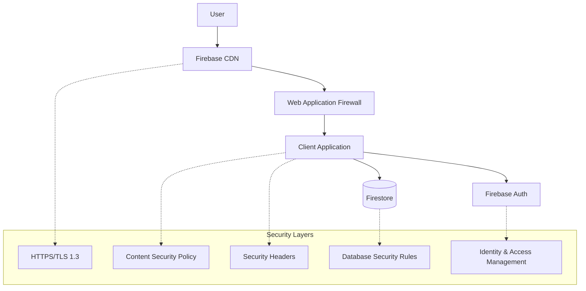

# Security Notes

Security architecture, measures, and compliance information for Budget Buckets.

## Security Architecture

Budget Buckets implements defense-in-depth security using Firebase's enterprise-grade infrastructure:



## Data Classification

### Personal Financial Information (PFI)
**Sensitivity**: High  
**Data Types**:
- Budget amounts and categories
- Income information
- Expense tracking data
- Financial goals and progress

**Protection Measures**:
- User-scoped database isolation
- Client-side encryption for sensitive fields
- Access restricted to authenticated user only
- No cross-user data visibility

### Personal Identifiable Information (PII)
**Sensitivity**: Medium  
**Data Types**:
- Email addresses (from authentication)
- Display names (optional)
- Profile information

**Protection Measures**:
- Firebase Auth handles PII securely
- No PII stored in application database
- OAuth providers manage identity data

### Application Metadata
**Sensitivity**: Low  
**Data Types**:
- Application usage statistics
- Error logs (anonymized)
- Performance metrics

**Protection Measures**:
- Aggregated and anonymized
- No direct user correlation
- Retention policies applied

## Authentication Security

### Firebase Authentication
```javascript
// Security configuration (auth/firebase.js:46-54)
const firebaseConfig = {
  // API key restricts access to authorized domains only
  apiKey: "restricted-to-budgetbucket.app",
  authDomain: "budget-buckets-prod.firebaseapp.com",
  projectId: "budget-buckets-prod"
  // Additional configuration...
};

// Secure authentication flow
export const authHelpers = {
  async signInWithGoogle() {
    const provider = new GoogleAuthProvider();
    try {
      // Preferred: popup (better UX, stays on domain)
      const result = await signInWithPopup(auth, provider);
      return result.user;
    } catch (error) {
      // Fallback: redirect (popup blocked)
      if (error.code === 'auth/popup-blocked') {
        await signInWithRedirect(auth, provider);
      }
      throw error;
    }
  }
};
```

**Security Features**:
- **Multi-provider**: Email/password + Google OAuth
- **Token Management**: Automatic refresh and secure storage
- **Session Security**: HTTP-only cookies, secure transmission
- **Domain Restrictions**: API keys limited to authorized domains
- **Popup/Redirect Fallback**: Prevents authentication bypass

### Authorization Model
```javascript
// Firestore security rules enforce user isolation
rules_version = '2';
service cloud.firestore {
  match /databases/{database}/documents {
    match /users/{uid} {
      // Users can only access their own data
      allow read, write: if request.auth != null && request.auth.uid == uid;
      
      match /{document=**} {
        // All subcollections inherit user restriction
        allow read, write: if request.auth != null && request.auth.uid == uid;
      }
    }
    
    // Deny all other access
    match /{document=**} {
      allow read, write: if false;
    }
  }
}
```

## Application Security

### Content Security Policy (CSP)
```javascript
// Implemented in server.js:27-58 and HTML meta tags
const cspDirectives = {
  "default-src": "'self'",
  "script-src": [
    "'self'",
    "https://www.gstatic.com",      // Firebase SDK
    "https://apis.google.com",      // Google APIs
    "https://www.googleapis.com"    // Google Auth
  ],
  "style-src": [
    "'self'",
    "'unsafe-inline'"               // Required for dynamic styles
  ],
  "img-src": [
    "'self'",
    "data:",                        // Base64 images
    "https://www.gstatic.com"       // Firebase assets
  ],
  "connect-src": [
    "'self'",
    "https://firestore.googleapis.com",      // Firestore API
    "https://identitytoolkit.googleapis.com", // Firebase Auth
    "https://securetoken.googleapis.com",     // Auth tokens
    "https://www.googleapis.com"              // Google APIs
  ],
  "frame-src": "*",                 // OAuth popups (restricted in production)
  "frame-ancestors": "'self'",      // Prevent embedding
  "base-uri": "'self'",
  "form-action": "'self'"
};
```

**Security Benefits**:
- Prevents XSS attacks via script injection
- Blocks unauthorized data exfiltration
- Restricts iframe embedding (clickjacking protection)
- Controls resource loading sources

### Security Headers
```javascript
// Additional security headers (server.js:27-58)
const securityHeaders = {
  "X-Content-Type-Options": "nosniff",           // Prevent MIME sniffing
  "X-Frame-Options": "DENY",                     // Prevent embedding
  "X-XSS-Protection": "1; mode=block",           // XSS filter
  "Strict-Transport-Security": "max-age=31536000; includeSubDomains", // HTTPS enforcement
  "Referrer-Policy": "strict-origin-when-cross-origin", // Referrer control
  "Permissions-Policy": "camera=(), microphone=(), geolocation=()" // Feature restrictions
};
```

### Input Validation and Sanitization
```javascript
// Client-side validation (app/cloud-store.js:30-80)
function validateBudgetData(budget) {
  // Sanitize and validate all user inputs
  const errors = [];
  
  // Required field validation
  if (!budget.name || budget.name.trim().length === 0) {
    errors.push("Budget name is required");
  }
  
  if (budget.name && budget.name.length > 100) {
    errors.push("Budget name must be 100 characters or less");
  }
  
  // Amount validation
  budget.expenses?.forEach((expense, expenseIndex) => {
    expense.items?.forEach((item, itemIndex) => {
      const amount = parseFloat(item.amount);
      if (isNaN(amount) || amount < 0 || amount > 999999.99) {
        errors.push(`Invalid amount in expense ${expense.name} item ${itemIndex + 1}`);
      }
    });
  });
  
  // Frequency validation
  const validFrequencies = ['Weekly', 'Fortnightly', 'Monthly', 'Yearly'];
  if (!validFrequencies.includes(budget.settings?.incomeFrequency)) {
    errors.push("Invalid income frequency");
  }
  
  return errors;
}

// Data scrubbing removes undefined values
function scrubUndefined(obj) {
  if (Array.isArray(obj)) {
    return obj.map(scrubUndefined).filter(item => item !== undefined);
  } else if (obj && typeof obj === 'object') {
    const scrubbed = {};
    for (const [key, value] of Object.entries(obj)) {
      if (value !== undefined) {
        scrubbed[key] = scrubUndefined(value);
      }
    }
    return scrubbed;
  }
  return obj;
}
```

## Database Security

### Firestore Security Rules
```javascript
// Comprehensive access control
rules_version = '2';
service cloud.firestore {
  match /databases/{database}/documents {
    // Helper functions
    function isAuthenticated() {
      return request.auth != null;
    }
    
    function isOwner(uid) {
      return isAuthenticated() && request.auth.uid == uid;
    }
    
    function isValidBudgetData() {
      return request.resource.data.keys().hasAll(['name', 'settings']) &&
             is_string(request.resource.data.name) &&
             request.resource.data.name.size() > 0 &&
             request.resource.data.name.size() <= 100;
    }
    
    // User data access
    match /users/{uid} {
      allow read: if isOwner(uid);
      allow write: if isOwner(uid) && isValidBudgetData();
      
      // Budget subcollections
      match /budgets/{budgetId} {
        allow read, write: if isOwner(uid) && isValidBudgetData();
      }
      
      // Profile subcollections
      match /profile/{document} {
        allow read, write: if isOwner(uid);
      }
    }
    
    // Admin collections (if needed)
    match /admin/{document} {
      // No public access to admin data
      allow read, write: if false;
    }
  }
}
```

**Security Features**:
- **User Isolation**: Complete data isolation between users
- **Authentication Required**: All operations require valid user session
- **Data Validation**: Server-side validation of data structure
- **Principle of Least Privilege**: Users can only access their own data

### Data Encryption

**In Transit**:
- TLS 1.3 for all connections
- Certificate pinning via Firebase
- End-to-end encryption for API calls

**At Rest**:
- Firebase handles encryption at rest
- AES-256 encryption for data storage
- Encrypted backups and snapshots

**Client-Side** (Optional Enhancement):
```javascript
// Encrypt sensitive fields before storage
class DataEncryption {
  constructor(userKey) {
    this.key = userKey; // Derived from user authentication
  }
  
  encryptSensitiveData(budget) {
    // Encrypt financial amounts
    const encrypted = { ...budget };
    
    encrypted.expenses = budget.expenses?.map(expense => ({
      ...expense,
      items: expense.items?.map(item => ({
        ...item,
        amount: this.encrypt(item.amount.toString())
      }))
    }));
    
    return encrypted;
  }
  
  encrypt(data) {
    // Implementation would use Web Crypto API
    // return crypto.subtle.encrypt(algorithm, this.key, data);
  }
}
```

## Infrastructure Security

### Firebase Security Features

**Network Security**:
- Global CDN with DDoS protection
- Automatic scaling and load balancing
- Geographic redundancy and failover

**Access Control**:
- IAM roles and permissions
- Service account management
- API key restrictions by domain/IP

**Monitoring and Logging**:
- Real-time security monitoring
- Audit logs for all operations
- Anomaly detection and alerting

### Domain and SSL/TLS

**Custom Domain Configuration**:
```bash
# Domain: budgetbucket.app
# DNS Configuration:
# A record: @ -> Firebase IP (173.252.74.22)
# CNAME record: www -> budgetbucket.app

# SSL Certificate:
# Provider: Let's Encrypt (managed by Firebase)
# Renewal: Automatic
# Protocols: TLS 1.2, TLS 1.3
```

**Certificate Security**:
- Automatic certificate renewal
- HTTP Strict Transport Security (HSTS)
- Certificate transparency logging
- Forward secrecy support

## Privacy Compliance

### GDPR Compliance

**Data Processing Basis**:
- **Consent**: Users explicitly consent to budget data processing
- **Contract**: Processing necessary for providing budgeting service
- **Legitimate Interest**: Service improvement and security

**User Rights Implementation**:
```javascript
// Data export (Right to Data Portability)
export async function exportUserData(uid) {
  const userDoc = await getDoc(doc(db, `users/${uid}`));
  const budgets = await getDocs(collection(db, `users/${uid}/budgets`));
  
  const exportData = {
    profile: userDoc.data(),
    budgets: budgets.docs.map(doc => ({ id: doc.id, ...doc.data() })),
    exportDate: new Date().toISOString(),
    format: "JSON"
  };
  
  return exportData;
}

// Data deletion (Right to Erasure)
export async function deleteUserData(uid) {
  const batch = writeBatch(db);
  
  // Delete user profile
  batch.delete(doc(db, `users/${uid}`));
  
  // Delete all budgets
  const budgets = await getDocs(collection(db, `users/${uid}/budgets`));
  budgets.forEach(budget => batch.delete(budget.ref));
  
  await batch.commit();
  
  // Also delete authentication account
  await deleteUser(auth.currentUser);
}
```

**Data Minimization**:
- Only collect data necessary for budgeting functionality
- No tracking of user behavior beyond application usage
- Minimal analytics and telemetry

### CCPA Compliance

**Consumer Rights**:
- **Right to Know**: Clear privacy policy describing data collection
- **Right to Delete**: Ability to delete all personal data
- **Right to Opt-Out**: No sale of personal information (not applicable)
- **Non-Discrimination**: No penalties for exercising privacy rights

### Regional Compliance

**Data Residency**:
- Firebase Firestore: us-central1 (United States)
- Can be configured for EU (europe-west1) if needed
- Data processing location documented in privacy policy

## Security Monitoring

### Error and Security Event Logging
```javascript
// Security event logging
class SecurityMonitor {
  static logSecurityEvent(event, details) {
    const securityLog = {
      timestamp: new Date().toISOString(),
      event: event,
      details: details,
      userAgent: navigator.userAgent,
      ip: 'client-side', // Server would capture real IP
      userId: auth.currentUser?.uid || 'anonymous'
    };
    
    console.warn('Security event:', securityLog);
    
    // In production, send to security monitoring service
    // this.sendToSecurityService(securityLog);
  }
  
  static reportAuthFailure(error) {
    this.logSecurityEvent('authentication_failure', {
      error: error.code,
      message: error.message
    });
  }
  
  static reportUnauthorizedAccess(resource) {
    this.logSecurityEvent('unauthorized_access', {
      resource: resource,
      timestamp: Date.now()
    });
  }
}

// Monitor authentication events
auth.onAuthStateChanged((user) => {
  if (user) {
    SecurityMonitor.logSecurityEvent('user_login', {
      method: user.providerData[0]?.providerId || 'unknown'
    });
  } else {
    SecurityMonitor.logSecurityEvent('user_logout', {});
  }
});
```

### Performance and Availability Monitoring
```javascript
// Security-relevant performance monitoring
class PerformanceSecurityMonitor {
  static monitorAPIResponseTimes() {
    const startTime = performance.now();
    
    return {
      end: () => {
        const duration = performance.now() - startTime;
        
        // Alert on unusually slow responses (potential DoS)
        if (duration > 10000) { // 10 seconds
          SecurityMonitor.logSecurityEvent('slow_api_response', {
            duration: duration,
            endpoint: window.location.pathname
          });
        }
      }
    };
  }
  
  static monitorFailureRates() {
    // Track consecutive failures (potential attack)
    let consecutiveFailures = 0;
    
    return {
      recordFailure: () => {
        consecutiveFailures++;
        if (consecutiveFailures > 5) {
          SecurityMonitor.logSecurityEvent('high_failure_rate', {
            consecutiveFailures: consecutiveFailures
          });
        }
      },
      recordSuccess: () => {
        consecutiveFailures = 0;
      }
    };
  }
}
```

## Incident Response

### Security Incident Classification

**Level 1 - Critical**:
- Data breach or unauthorized data access
- Authentication bypass discovered
- Malware or code injection detected
- Service compromise

**Level 2 - High**:
- Attempted unauthorized access (blocked)
- Security configuration error
- Suspicious user activity patterns
- Vulnerability discovery

**Level 3 - Medium**:
- Security policy violations
- Configuration drift
- Non-critical security updates needed

### Response Procedures

1. **Immediate Containment** (0-15 minutes)
   - Isolate affected systems
   - Revoke compromised credentials
   - Block malicious traffic

2. **Assessment** (15-60 minutes)
   - Determine scope of incident
   - Assess data exposure risk
   - Document evidence

3. **Notification** (1-24 hours)
   - Internal team notification
   - User notification if data affected
   - Regulatory notification if required

4. **Recovery** (Ongoing)
   - Implement fixes
   - Restore normal operations
   - Monitor for recurrence

## Security Best Practices

### Development Security

1. **Secure Coding**:
   - Input validation on all user inputs
   - Output encoding to prevent XSS
   - Use parameterized queries (Firestore handles this)
   - Implement proper error handling

2. **Dependency Management**:
   ```bash
   # Regular security audits
   npm audit
   npm update
   
   # Check for known vulnerabilities
   npm audit --audit-level moderate
   ```

3. **Code Review Process**:
   - All changes reviewed by second developer
   - Security-focused review checklist
   - Automated security scanning in CI/CD

### Operational Security

1. **Access Management**:
   - Principle of least privilege
   - Regular access reviews
   - Multi-factor authentication for admin accounts

2. **Secret Management**:
   - Regular rotation of API keys and certificates
   - No secrets in source code
   - Secure secret storage and distribution

3. **Monitoring and Alerting**:
   - Real-time security event monitoring
   - Automated alert thresholds
   - Regular security metric reviews

## Compliance and Auditing

### Security Frameworks

**SOC 2 Type II** (Applicable Controls):
- Access controls and user authentication
- Data encryption in transit and at rest
- Security monitoring and incident response
- Vendor management (Firebase/Google Cloud)

**ISO 27001** (Relevant Areas):
- Information security management system
- Risk assessment and treatment
- Security policies and procedures
- Incident management

### Audit Trail

All security-relevant events are logged:
- User authentication events
- Data access and modifications  
- Configuration changes
- Security incidents and responses
- Access control changes

### Regular Security Reviews

**Monthly**:
- Security log review
- Access control audit
- Dependency vulnerability scan

**Quarterly**:
- Security policy review
- Penetration testing (if budget allows)
- Business continuity plan testing

**Annually**:
- Comprehensive security assessment
- Compliance framework review
- Security training and awareness

## References

- [System Architecture](../architecture/system-overview.md)
- [Authentication Flow](../architecture/dataflow.md#authentication-flow)
- [Configuration Reference](../reference/configuration.md)
- [Incident Response Playbook](../runbooks/incident-playbook.md)
- [Secret Rotation Procedures](../runbooks/rotate-secrets.md)
- [Firebase Security Documentation](https://firebase.google.com/docs/security)
- [OWASP Security Guidelines](https://owasp.org/www-project-top-ten/)