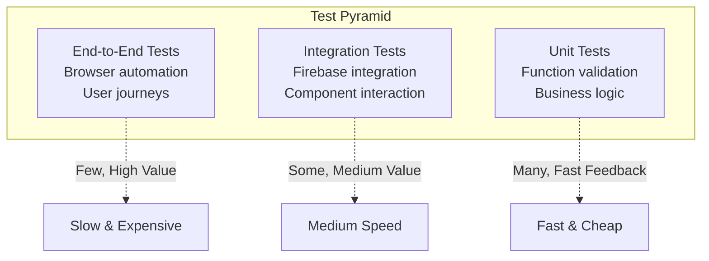

# Testing Strategy

Comprehensive testing approach for Budget Buckets covering unit tests, integration tests, and end-to-end validation.

## Testing Philosophy

Budget Buckets uses a **risk-based testing approach** focused on:
- **Financial Accuracy**: Critical calculations must be correct
- **Data Integrity**: User data must not be lost or corrupted
- **Authentication Security**: User isolation must be maintained
- **Cross-browser Compatibility**: Works on all major browsers
- **Performance**: Responsive user experience maintained

## Test Pyramid



## Current Testing Implementation

### Manual Test Suite

Budget Buckets currently implements comprehensive manual testing through built-in test pages:

#### 1. Smoke Test (`test/smoke-test.html`)
**Purpose**: Verify core functionality works  
**Frequency**: Every deployment, on-demand debugging  
**Coverage**:
- Firebase SDK initialization
- Authentication state management
- Firestore connection and permissions
- Basic CRUD operations
- Data validation rules

```javascript
// Smoke test implementation highlights
const smokeTests = {
  async testFirebaseInitialization() {
    // Test Firebase SDK loads and initializes
    if (typeof firebase === 'undefined') {
      return { status: 'FAILED', message: 'Firebase SDK not loaded' };
    }
    
    try {
      const app = firebase.app();
      return { status: 'PASSED', message: `Firebase initialized: ${app.name}` };
    } catch (error) {
      return { status: 'FAILED', message: error.message };
    }
  },
  
  async testAuthentication() {
    // Test authentication flow
    const user = await authHelpers.waitForAuth(5000);
    if (user) {
      return { status: 'PASSED', message: `Authenticated as: ${user.email}` };
    } else {
      return { status: 'FAILED', message: 'Authentication required for full testing' };
    }
  },
  
  async testDataOperations() {
    // Test basic Firestore operations
    const testData = { name: 'Test Budget', timestamp: Date.now() };
    try {
      await firestoreHelpers.saveDocument('test', testData);
      const retrieved = await firestoreHelpers.loadDocument('test');
      
      if (retrieved && retrieved.name === testData.name) {
        return { status: 'PASSED', message: 'Data save/load successful' };
      } else {
        return { status: 'FAILED', message: 'Data integrity check failed' };
      }
    } catch (error) {
      return { status: 'FAILED', message: `Database error: ${error.message}` };
    }
  }
};
```

#### 2. Network Diagnostic (`test/network-diagnostic.html`)
**Purpose**: Diagnose connectivity issues  
**Coverage**:
- Firebase service endpoint connectivity
- DNS resolution for Firebase domains
- Network latency measurements
- Cross-origin request handling

#### 3. Firestore Debug (`test/debug-firestore.html`)
**Purpose**: Deep database testing  
**Coverage**:
- Security rules validation
- Complex query testing
- Data structure validation
- Performance profiling

## Unit Testing Strategy

### Test Framework Selection

**Recommended**: Jest with Firebase Test SDK
```bash
# Install testing dependencies
npm install --save-dev jest @firebase/rules-unit-testing

# Jest configuration (jest.config.js)
module.exports = {
  testEnvironment: 'jsdom',
  setupFiles: ['<rootDir>/test/setup.js'],
  testMatch: ['**/__tests__/**/*.js', '**/?(*.)+(spec|test).js'],
  collectCoverageFrom: [
    'app/**/*.js',
    'auth/**/*.js',
    'migrations/**/*.js',
    '!**/*.config.js'
  ],
  coverageThreshold: {
    global: {
      branches: 70,
      functions: 70,
      lines: 70,
      statements: 70
    }
  }
};
```

### Unit Test Categories

#### 1. Business Logic Tests
```javascript
// Example: Budget calculation tests
describe('Budget Calculations', () => {
  test('calculates total expenses correctly', () => {
    const budget = {
      expenses: [
        {
          items: [
            { amount: 1500, include: true },
            { amount: 300, include: true },
            { amount: 100, include: false }  // Excluded
          ]
        }
      ]
    };
    
    const total = calculateTotalExpenses(budget);
    expect(total).toBe(1800); // Only included items
  });
  
  test('handles invalid amounts gracefully', () => {
    const budget = {
      expenses: [
        {
          items: [
            { amount: 'invalid', include: true },
            { amount: null, include: true },
            { amount: 500, include: true }
          ]
        }
      ]
    };
    
    const total = calculateTotalExpenses(budget);
    expect(total).toBe(500); // Only valid amounts
  });
  
  test('calculates budget surplus/deficit', () => {
    const budget = {
      settings: { incomeAmount: 5000 },
      expenses: [{ items: [{ amount: 3000, include: true }] }],
      savings: [{ items: [{ amount: 1500, include: true }] }]
    };
    
    const result = calculateBudgetBalance(budget);
    expect(result.surplus).toBe(500);
    expect(result.balanced).toBe(true);
  });
});
```

#### 2. Data Validation Tests
```javascript
// Example: Input validation tests
describe('Data Validation', () => {
  test('validates budget name requirements', () => {
    const validBudget = { name: 'My Budget', settings: {} };
    const invalidBudget = { name: '', settings: {} };
    
    expect(validateBudgetData(validBudget)).toHaveLength(0);
    expect(validateBudgetData(invalidBudget)).toContain('Budget name is required');
  });
  
  test('validates expense amounts', () => {
    const budget = {
      name: 'Test',
      expenses: [{
        name: 'Housing',
        items: [
          { name: 'Rent', amount: -100 }, // Invalid: negative
          { name: 'Utilities', amount: 1000000 }, // Invalid: too large
          { name: 'Internet', amount: 50 } // Valid
        ]
      }]
    };
    
    const errors = validateBudgetData(budget);
    expect(errors).toHaveLength(2);
    expect(errors[0]).toContain('Invalid amount');
  });
});
```

#### 3. Utility Function Tests
```javascript
// Example: Helper function tests
describe('Utility Functions', () => {
  test('formats currency correctly', () => {
    expect(formatCurrency(1234.56, 'AUD')).toBe('$1,234.56');
    expect(formatCurrency(0, 'USD')).toBe('$0.00');
    expect(formatCurrency(1000000, 'AUD')).toBe('$1,000,000.00');
  });
  
  test('scrubs undefined values from objects', () => {
    const input = {
      name: 'Test',
      amount: 100,
      invalid: undefined,
      nested: {
        valid: 'value',
        invalid: undefined
      }
    };
    
    const result = scrubUndefined(input);
    expect(result).toEqual({
      name: 'Test',
      amount: 100,
      nested: { valid: 'value' }
    });
  });
});
```

## Integration Testing Strategy

### Firebase Integration Tests

#### 1. Authentication Integration
```javascript
// Example: Authentication integration tests
describe('Firebase Authentication', () => {
  let auth;
  
  beforeAll(async () => {
    // Initialize test environment
    auth = firebase.auth();
    await auth.useEmulator('http://localhost:9099');
  });
  
  test('creates new user account', async () => {
    const testEmail = `test-${Date.now()}@example.com`;
    const testPassword = 'testPassword123';
    
    const userCredential = await auth.createUserWithEmailAndPassword(
      testEmail, 
      testPassword
    );
    
    expect(userCredential.user.email).toBe(testEmail);
    expect(userCredential.user.uid).toBeTruthy();
  });
  
  test('signs in existing user', async () => {
    const testEmail = 'existing@example.com';
    const testPassword = 'password123';
    
    const userCredential = await auth.signInWithEmailAndPassword(
      testEmail,
      testPassword
    );
    
    expect(userCredential.user.email).toBe(testEmail);
  });
});
```

#### 2. Firestore Integration
```javascript
// Example: Database integration tests  
describe('Firestore Operations', () => {
  let db;
  let testUserId;
  
  beforeAll(async () => {
    db = firebase.firestore();
    await db.useEmulator('localhost', 8080);
    testUserId = `test-user-${Date.now()}`;
  });
  
  test('saves and retrieves budget data', async () => {
    const budgetData = {
      name: 'Test Budget',
      settings: { incomeAmount: 5000 },
      createdAt: firebase.firestore.FieldValue.serverTimestamp()
    };
    
    // Save data
    await db.collection(`users/${testUserId}/budgets`).add(budgetData);
    
    // Retrieve data
    const snapshot = await db.collection(`users/${testUserId}/budgets`)
                            .where('name', '==', 'Test Budget')
                            .get();
    
    expect(snapshot.size).toBe(1);
    const retrieved = snapshot.docs[0].data();
    expect(retrieved.name).toBe('Test Budget');
    expect(retrieved.settings.incomeAmount).toBe(5000);
  });
  
  test('enforces security rules', async () => {
    const otherUserId = 'other-user';
    
    // Attempt to access another user's data should fail
    await expect(
      db.collection(`users/${otherUserId}/budgets`).get()
    ).rejects.toThrow('permission-denied');
  });
});
```

### Component Integration Tests
```javascript
// Example: UI component integration
describe('Budget Display Integration', () => {
  test('updates UI when budget data changes', async () => {
    // Mock DOM environment
    document.body.innerHTML = '<div id="budget-total">$0.00</div>';
    
    const budgetData = {
      expenses: [{ items: [{ amount: 1500, include: true }] }],
      savings: [{ items: [{ amount: 500, include: true }] }]
    };
    
    // Simulate data update
    updateBudgetUI(budgetData);
    
    const totalElement = document.getElementById('budget-total');
    expect(totalElement.textContent).toBe('$2,000.00');
  });
});
```

## End-to-End Testing Strategy

### E2E Testing Framework

**Recommended**: Playwright for cross-browser testing
```bash
# Install Playwright
npm install --save-dev @playwright/test

# Playwright configuration (playwright.config.js)
module.exports = {
  testDir: './e2e-tests',
  timeout: 30000,
  retries: 2,
  use: {
    headless: true,
    screenshot: 'only-on-failure',
    video: 'retain-on-failure'
  },
  projects: [
    { name: 'chromium', use: { ...devices['Desktop Chrome'] } },
    { name: 'firefox', use: { ...devices['Desktop Firefox'] } },
    { name: 'webkit', use: { ...devices['Desktop Safari'] } },
    { name: 'mobile', use: { ...devices['iPhone 12'] } }
  ]
};
```

### Critical User Journey Tests

#### 1. User Registration and Onboarding
```javascript
// e2e-tests/user-registration.spec.js
test('complete user registration flow', async ({ page }) => {
  // Navigate to homepage
  await page.goto('/');
  
  // Click sign up
  await page.click('text=Sign Up');
  
  // Fill registration form
  await page.fill('[data-testid=email-input]', 'newuser@example.com');
  await page.fill('[data-testid=password-input]', 'securePassword123');
  await page.click('[data-testid=signup-button]');
  
  // Wait for redirect to app
  await page.waitForURL('/app/index.html');
  
  // Verify welcome message
  await expect(page.locator('text=Welcome to Budget Buckets')).toBeVisible();
  
  // Create first budget
  await page.click('[data-testid=create-budget-button]');
  await page.fill('[data-testid=budget-name]', 'My First Budget');
  await page.fill('[data-testid=income-amount]', '5000');
  await page.selectOption('[data-testid=income-frequency]', 'Monthly');
  await page.click('[data-testid=save-budget]');
  
  // Verify budget created
  await expect(page.locator('text=My First Budget')).toBeVisible();
});
```

#### 2. Budget Creation and Management
```javascript
// e2e-tests/budget-management.spec.js
test('creates and manages budget', async ({ page }) => {
  // Login as existing user
  await loginAsTestUser(page);
  
  // Create new budget
  await page.click('[data-testid=new-budget]');
  await page.fill('[data-testid=budget-name]', 'Monthly Budget');
  await page.fill('[data-testid=income-amount]', '6000');
  
  // Add expense category
  await page.click('[data-testid=add-expense-category]');
  await page.fill('[data-testid=expense-name]', 'Housing');
  await page.selectOption('[data-testid=expense-color]', '#3b82f6');
  
  // Add expense items
  await page.click('[data-testid=add-expense-item]');
  await page.fill('[data-testid=item-name]', 'Rent');
  await page.fill('[data-testid=item-amount]', '2000');
  
  await page.click('[data-testid=add-expense-item]');
  await page.fill('[data-testid=item-name-1]', 'Utilities');
  await page.fill('[data-testid=item-amount-1]', '300');
  
  // Save budget
  await page.click('[data-testid=save-budget]');
  
  // Verify calculations
  await expect(page.locator('[data-testid=total-expenses]')).toHaveText('$2,300.00');
  await expect(page.locator('[data-testid=remaining-income]')).toHaveText('$3,700.00');
});
```

#### 3. Data Persistence and Synchronization
```javascript
// e2e-tests/data-persistence.spec.js  
test('data persists across browser sessions', async ({ browser }) => {
  // First session: Create budget
  const context1 = await browser.newContext();
  const page1 = await context1.newPage();
  
  await loginAsTestUser(page1);
  await createTestBudget(page1, 'Persistence Test');
  
  await context1.close();
  
  // Second session: Verify budget exists
  const context2 = await browser.newContext();
  const page2 = await context2.newPage();
  
  await loginAsTestUser(page2);
  await expect(page2.locator('text=Persistence Test')).toBeVisible();
  
  await context2.close();
});
```

## Performance Testing

### Load Testing Strategy

#### 1. Firebase Quota Testing
```javascript
// Test Firebase usage limits
describe('Firebase Performance', () => {
  test('handles concurrent user operations', async () => {
    const promises = [];
    
    // Simulate 10 concurrent users
    for (let i = 0; i < 10; i++) {
      promises.push(
        createTestBudget(`User ${i} Budget`)
      );
    }
    
    const results = await Promise.all(promises);
    results.forEach(result => {
      expect(result.success).toBe(true);
    });
  });
  
  test('respects Firestore read/write limits', async () => {
    const startTime = Date.now();
    
    // Perform many operations
    for (let i = 0; i < 100; i++) {
      await db.collection('test').add({ index: i });
    }
    
    const duration = Date.now() - startTime;
    // Should complete within reasonable time
    expect(duration).toBeLessThan(30000); // 30 seconds
  });
});
```

#### 2. Client Performance Testing
```javascript
// Performance benchmarks
describe('Client Performance', () => {
  test('budget calculations complete quickly', () => {
    const largeBudget = generateLargeBudget(100); // 100 categories
    
    const startTime = performance.now();
    const result = calculateBudgetTotals(largeBudget);
    const duration = performance.now() - startTime;
    
    expect(duration).toBeLessThan(100); // 100ms
    expect(result.totalExpenses).toBeGreaterThan(0);
  });
  
  test('UI updates are responsive', async () => {
    const startTime = performance.now();
    
    // Simulate data change
    updateBudgetUI(testBudgetData);
    
    // Wait for DOM updates
    await new Promise(resolve => setTimeout(resolve, 0));
    
    const duration = performance.now() - startTime;
    expect(duration).toBeLessThan(50); // 50ms for UI updates
  });
});
```

## Test Data Management

### Test Data Strategy

#### 1. Test Data Generation
```javascript
// Test data factories
const TestDataFactory = {
  createBudget: (overrides = {}) => ({
    name: 'Test Budget',
    settings: {
      incomeAmount: 5000,
      incomeFrequency: 'Monthly',
      currency: 'AUD'
    },
    expenses: [
      {
        id: 'housing',
        name: 'Housing',
        color: '#3b82f6',
        include: true,
        items: [
          { id: 'rent', name: 'Rent', amount: 2000, include: true }
        ]
      }
    ],
    savings: [
      {
        id: 'emergency',
        name: 'Emergency Fund',
        color: '#10b981',
        include: true,
        items: [
          { id: 'monthly', name: 'Monthly Savings', amount: 1000, include: true }
        ]
      }
    ],
    createdAt: new Date().toISOString(),
    ...overrides
  }),
  
  createUser: (overrides = {}) => ({
    uid: `test-user-${Date.now()}`,
    email: `test-${Date.now()}@example.com`,
    displayName: 'Test User',
    ...overrides
  })
};
```

#### 2. Test Database Seeding
```bash
#!/bin/bash
# seed-test-data.sh

# Start Firebase emulators
firebase emulators:start --import=./test-data &
EMULATOR_PID=$!

# Wait for emulators to start
sleep 10

# Run seeding script
node scripts/seed-test-data.js

# Keep emulators running for tests
wait $EMULATOR_PID
```

```javascript
// scripts/seed-test-data.js
const admin = require('firebase-admin');

// Initialize Firebase Admin SDK
admin.initializeApp({
  projectId: 'budget-buckets-test'
});

const db = admin.firestore();

async function seedTestData() {
  // Create test users with sample budgets
  const testUsers = [
    { uid: 'test-user-1', email: 'user1@test.com' },
    { uid: 'test-user-2', email: 'user2@test.com' }
  ];
  
  for (const user of testUsers) {
    // Create user profile
    await db.collection(`users`).doc(user.uid).set({
      profile: {
        email: user.email,
        createdAt: admin.firestore.FieldValue.serverTimestamp(),
        schemaVersion: 2
      }
    });
    
    // Create sample budget
    await db.collection(`users/${user.uid}/budgets`).add(
      TestDataFactory.createBudget({
        name: `${user.email}'s Budget`
      })
    );
  }
  
  console.log('Test data seeded successfully');
}

seedTestData().catch(console.error);
```

## Test Automation and CI/CD

### GitHub Actions Integration

```yaml
# .github/workflows/test.yml
name: Test Suite

on:
  push:
    branches: [ main, develop ]
  pull_request:
    branches: [ main ]

jobs:
  unit-tests:
    runs-on: ubuntu-latest
    steps:
      - uses: actions/checkout@v3
      - uses: actions/setup-node@v3
        with:
          node-version: '20'
          cache: 'npm'
      
      - name: Install dependencies
        run: npm ci
      
      - name: Run unit tests
        run: npm test -- --coverage
      
      - name: Upload coverage reports
        uses: codecov/codecov-action@v3

  integration-tests:
    runs-on: ubuntu-latest
    steps:
      - uses: actions/checkout@v3
      - uses: actions/setup-node@v3
        with:
          node-version: '20'
          cache: 'npm'
      
      - name: Install dependencies
        run: npm ci
      
      - name: Install Firebase CLI
        run: npm install -g firebase-tools
      
      - name: Start Firebase Emulators
        run: firebase emulators:start --import=./test-data --detach
      
      - name: Run integration tests
        run: npm run test:integration
      
      - name: Stop Firebase Emulators
        run: firebase emulators:kill

  e2e-tests:
    runs-on: ubuntu-latest
    steps:
      - uses: actions/checkout@v3
      - uses: actions/setup-node@v3
        with:
          node-version: '20'
          cache: 'npm'
      
      - name: Install dependencies
        run: npm ci
      
      - name: Install Playwright Browsers
        run: npx playwright install --with-deps
      
      - name: Start Firebase Emulators
        run: firebase emulators:start --import=./test-data --detach
      
      - name: Start dev server
        run: npm start &
        
      - name: Run E2E tests
        run: npx playwright test
      
      - uses: actions/upload-artifact@v3
        if: failure()
        with:
          name: playwright-report
          path: playwright-report/
```

### Test Coverage Requirements

```javascript
// jest.config.js - Coverage requirements
module.exports = {
  collectCoverageFrom: [
    'app/**/*.js',
    'auth/**/*.js', 
    'migrations/**/*.js',
    '!**/*.config.js',
    '!**/test/**'
  ],
  coverageThreshold: {
    global: {
      branches: 70,
      functions: 70,
      lines: 70,
      statements: 70
    },
    // Higher requirements for critical modules
    'app/cloud-store.js': {
      branches: 85,
      functions: 85,
      lines: 85,
      statements: 85
    },
    'auth/firebase.js': {
      branches: 80,
      functions: 80,
      lines: 80,
      statements: 80
    }
  }
};
```

## Quality Gates and Release Testing

### Pre-deployment Checklist

- [ ] All unit tests pass (100%)
- [ ] Integration tests pass (100%)
- [ ] E2E critical path tests pass (100%)
- [ ] Code coverage meets requirements (>70% overall)
- [ ] No high-severity security vulnerabilities
- [ ] Performance benchmarks within acceptable range
- [ ] Cross-browser compatibility verified
- [ ] Manual smoke test passes

### Release Testing Process

1. **Staging Deployment Testing**
   - Deploy to staging environment
   - Run full test suite against staging
   - Perform manual exploratory testing
   - Validate with real data subset

2. **Production Testing**  
   - Deploy to production
   - Run smoke tests immediately
   - Monitor error rates and performance
   - Gradual rollout with monitoring

3. **Post-release Monitoring**
   - 24-hour monitoring period
   - User feedback collection
   - Error rate and performance tracking
   - Rollback triggers defined

## Future Testing Enhancements

### Recommended Additions

1. **Visual Regression Testing**
   - Screenshot comparison testing
   - UI consistency validation
   - Cross-browser visual verification

2. **Accessibility Testing**
   - WCAG compliance validation
   - Screen reader compatibility
   - Keyboard navigation testing

3. **Security Testing** 
   - Automated security scanning
   - Penetration testing integration
   - Vulnerability assessment

4. **Load Testing**
   - Stress testing with realistic user loads
   - Performance degradation thresholds
   - Scalability validation

## References

- [System Architecture](../architecture/system-overview.md)
- [Development Setup](../guides/setup-dev.md)
- [Troubleshooting Guide](../guides/troubleshooting.md)
- [Configuration Reference](../reference/configuration.md)
- [Jest Documentation](https://jestjs.io/docs/getting-started)
- [Playwright Documentation](https://playwright.dev/)
- [Firebase Testing Documentation](https://firebase.google.com/docs/emulator-suite)